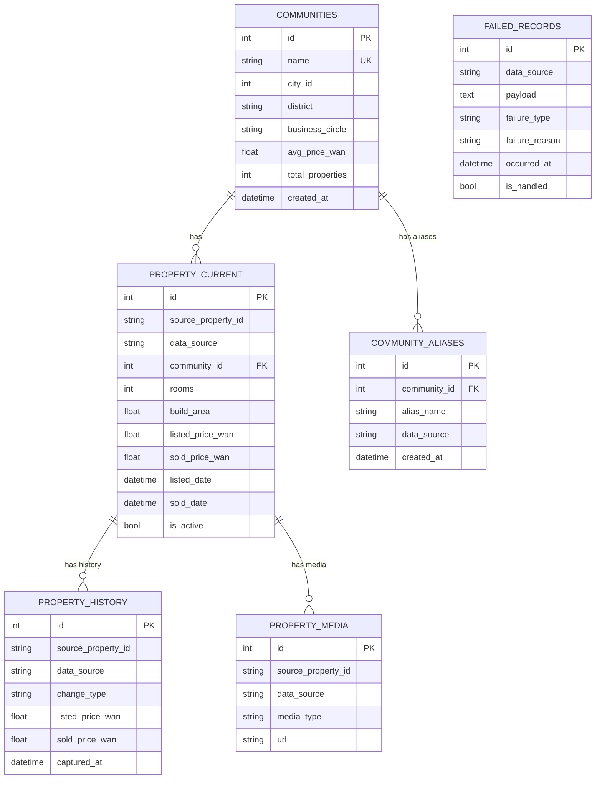

# Design Document

## Overview

Profo 房产数据中心采用前后端分离的架构，使用 FastAPI (Python) 作为后端框架，Vue 3 + TypeScript 作为前端框架，SQLite 作为本地数据库。系统设计遵循以下核心原则：

- **数据完整性优先**: 所有输入数据必须通过 Pydantic 模型严格校验，失败数据隔离存储
- **高性能查询**: 使用虚拟滚动和数据库索引优化，支持万条级数据流畅展示
- **本地化部署**: 无需外部服务依赖，一键启动即可使用
- **数据治理能力**: 提供小区合并等数据清洗工具，持续提升数据质量

## Architecture

### System Architecture Diagram

```
┌─────────────────────────────────────────────────────────────────┐
│                         Browser (用户浏览器)                      │
│                    http://localhost:3000                        │
└────────────────────────────┬────────────────────────────────────┘
                             │ HTTP/JSON
                             ▼
┌─────────────────────────────────────────────────────────────────┐
│                    Frontend (Vue 3 + Vite)                      │
│  ┌──────────────┐  ┌──────────────┐  ┌──────────────┐         │
│  │   Router     │  │    Pinia     │  │  Components  │         │
│  │  (vue-router)│  │   (State)    │  │  (UI Layer)  │         │
│  └──────────────┘  └──────────────┘  └──────────────┘         │
│         │                  │                  │                 │
│         └──────────────────┴──────────────────┘                 │
│                            │                                    │
│                    ┌───────▼────────┐                          │
│                    │  API Client    │                          │
│                    │   (Axios)      │                          │
│                    └───────┬────────┘                          │
└────────────────────────────┼────────────────────────────────────┘
                             │ REST API
                             ▼
┌─────────────────────────────────────────────────────────────────┐
│                Backend (FastAPI + Python 3.10+)                 │
│                    http://localhost:8000                        │
│  ┌──────────────────────────────────────────────────────────┐  │
│  │                    API Routers                            │  │
│  │  /properties  /upload  /push  /admin                     │  │
│  └────────────────────┬─────────────────────────────────────┘  │
│                       │                                         │
│  ┌────────────────────▼─────────────────────────────────────┐  │
│  │                  Services Layer                          │  │
│  │  importer.py  │  parser.py  │  merger.py                │  │
│  └────────────────────┬─────────────────────────────────────┘  │
│                       │                                         │
│  ┌────────────────────▼─────────────────────────────────────┐  │
│  │              Data Access Layer (ORM)                     │  │
│  │                  SQLAlchemy 2.0                          │  │
│  └────────────────────┬─────────────────────────────────────┘  │
└───────────────────────┼──────────────────────────────────────────┘
                        │
                        ▼
┌─────────────────────────────────────────────────────────────────┐
│                    SQLite Database                              │
│                      data.db (本地文件)                          │
│  ┌──────────────┐  ┌──────────────┐  ┌──────────────┐         │
│  │ communities  │  │property_current│ │property_history│       │
│  └──────────────┘  └──────────────┘  └──────────────┘         │
│  ┌──────────────┐  ┌──────────────┐  ┌──────────────┐         │
│  │community_    │  │property_media│  │failed_records│         │
│  │  aliases     │  │              │  │              │         │
│  └──────────────┘  └──────────────┘  └──────────────┘         │
└─────────────────────────────────────────────────────────────────┘
```

### Technology Stack


**Backend:**
- Python 3.10+ with UV package manager
- FastAPI 0.104+ for REST API
- SQLAlchemy 2.0+ for ORM
- Pydantic 2.5+ for data validation
- SQLite for local database

**Frontend:**
- Vue 3.x with Composition API
- Vite 5.x for build tooling
- TypeScript 5.x for type safety
- Pinia 2.x for state management
- TailwindCSS 3.x for styling
- @tanstack/vue-virtual for virtual scrolling
- Axios for HTTP client
- pnpm for package management

## Components and Interfaces

### Backend Components

#### 1. API Router Layer (`backend/routers/`)

**properties.py** - 房源查询与导出
```python
GET  /api/properties
     Query Parameters:
     - status: str (optional) - "在售" | "成交" | null (全部)
     - community_name: str (optional) - 小区名模糊搜索
     - min_price: float (optional) - 最低总价(万)
     - max_price: float (optional) - 最高总价(万)
     - min_area: float (optional) - 最小面积(㎡)
     - max_area: float (optional) - 最大面积(㎡)
     - rooms: List[int] (optional) - 室数量列表
     - sort_by: str (optional) - 排序字段
     - sort_order: str (optional) - "asc" | "desc"
     - page: int (default: 1)
     - page_size: int (default: 50)
     
     Response: {
       "total": int,
       "page": int,
       "page_size": int,
       "items": List[PropertyResponse]
     }

GET  /api/properties/export
     Query Parameters: (same as /api/properties)
     Response: CSV file stream
```

**upload.py** - CSV 文件上传
```python
POST /api/upload/csv
     Content-Type: multipart/form-data
     Body: file (CSV file)
     
     Response: {
       "total": int,
       "success": int,
       "failed": int,
       "failed_file_url": str (optional)
     }
```

**push.py** - JSON 数据推送
```python
POST /api/push
     Content-Type: application/json
     Body: List[PropertyIngestionModel]
     
     Response: {
       "total": int,
       "success": int,
       "failed": int,
       "errors": List[{"index": int, "reason": str}]
     }
```

**admin.py** - 小区管理
```python
GET  /api/admin/communities
     Query Parameters:
     - search: str (optional) - 小区名搜索
     - page: int (default: 1)
     - page_size: int (default: 50)
     
     Response: {
       "total": int,
       "items": List[{
         "id": int,
         "name": str,
         "property_count": int,
         "district": str
       }]
     }

POST /api/admin/communities/merge
     Body: {
       "primary_id": int,
       "merge_ids": List[int]
     }
     
     Response: {
       "success": bool,
       "affected_properties": int,
       "message": str
     }
```

#### 2. Service Layer (`backend/services/`)

**importer.py** - 数据导入核心逻辑

```python
class PropertyImporter:
    """处理房源数据导入的核心服务"""
    
    def import_property(self, data: PropertyIngestionModel, db: Session) -> ImportResult:
        """
        导入单条房源数据
        
        流程:
        1. 查找或创建小区 (find_or_create_community)
        2. 检查房源是否存在 (data_source + source_property_id)
        3. 如果存在: 创建历史快照 + 更新当前记录
        4. 如果不存在: 解析楼层 + 创建新记录
        
        Returns:
            ImportResult(success: bool, property_id: int, error: str)
        """
        
    def find_or_create_community(self, name: str, db: Session) -> int:
        """
        查找或创建小区
        
        逻辑:
        1. 先在 communities 表中精确匹配 name
        2. 如果不存在，检查 community_aliases 表
        3. 如果都不存在，创建新小区记录
        
        Returns:
            community_id
        """
        
    def create_history_snapshot(self, property: Property, db: Session):
        """
        创建历史快照
        
        将 property_current 的当前状态复制到 property_history
        记录 change_type 和 captured_at
        """
        
    def batch_import_csv(self, file: UploadFile, db: Session) -> BatchImportResult:
        """
        批量导入 CSV 文件
        
        流程:
        1. 解析 CSV 文件
        2. 逐行验证并导入
        3. 收集失败记录
        4. 生成失败记录 CSV
        
        Returns:
            BatchImportResult(total, success, failed, failed_records)
        """
```

**parser.py** - 数据解析工具
```python
class FloorParser:
    """楼层信息解析器"""
    
    @staticmethod
    def parse_floor(floor_original: str) -> FloorInfo:
        """
        解析楼层字符串
        
        支持格式:
        - "高楼层/18" -> floor_number=None, total_floors=18, level="高楼层"
        - "15/28" -> floor_number=15, total_floors=28, level="中楼层"
        - "中楼层/共28层" -> floor_number=None, total_floors=28, level="中楼层"
        
        Returns:
            FloorInfo(floor_number, total_floors, floor_level)
        """
        
    @staticmethod
    def calculate_floor_level(floor_number: int, total_floors: int) -> str:
        """
        计算楼层级别
        
        规则:
        - <= 33%: 低楼层
        - 33% - 67%: 中楼层
        - > 67%: 高楼层
        """
```

**merger.py** - 小区合并服务
```python
class CommunityMerger:
    """小区数据治理服务"""
    
    def merge_communities(
        self, 
        primary_id: int, 
        merge_ids: List[int], 
        db: Session
    ) -> MergeResult:
        """
        合并小区
        
        流程:
        1. 验证所有小区 ID 存在
        2. 统计受影响的房源数量
        3. 将被合并小区名称存入 community_aliases
        4. 更新所有关联房源的 community_id
        5. 软删除被合并的小区记录
        
        Returns:
            MergeResult(success, affected_properties, message)
        """
```

#### 3. Data Models (`backend/models.py`)

核心表结构已在 PRD 中详细定义，关键设计决策：

- **唯一性约束**: (data_source, source_property_id) 确保同一来源的房源不重复
- **外键关联**: property_current.community_id -> communities.id
- **索引优化**: 
  - idx_community_price: (community_id, listed_price_wan) 加速小区价格查询
  - idx_history_lookup: (data_source, source_property_id, captured_at DESC) 加速历史查询
- **软删除**: 使用 is_active 标记而非物理删除

#### 4. Validation Schemas (`backend/schemas.py`)

**PropertyIngestionModel** - 数据接收契约

```python
class PropertyIngestionModel(BaseModel):
    """统一的数据接收模型，支持 CSV 和 JSON"""
    
    # 核心唯一标识
    data_source: str = Field(..., alias="数据源")
    source_property_id: str = Field(..., alias="房源ID")
    
    # 核心业务字段
    status: IngestionStatus = Field(..., alias="状态")  # "在售" | "成交"
    community_name: str = Field(..., alias="小区名")
    rooms: int = Field(..., ge=0, alias="室")
    orientation: str = Field(..., alias="朝向")
    floor_original: str = Field(..., alias="楼层")
    build_area: float = Field(..., gt=0, alias="面积")
    
    # 动态必填字段
    listed_price_wan: Optional[float] = Field(None, gt=0, alias="挂牌价(万)")
    sold_price_wan: Optional[float] = Field(None, gt=0, alias="成交价(万)")
    listed_date: Optional[datetime] = Field(None, alias="上架时间")
    sold_date: Optional[datetime] = Field(None, alias="成交时间")
    
    # 其他可选字段
    halls: int = Field(0, ge=0, alias="厅")
    baths: int = Field(0, ge=0, alias="卫")
    # ... (其他字段)
    
    @root_validator
    def validate_fields_based_on_status(cls, values):
        """根据状态动态验证必填字段"""
        status = values.get('status')
        if status == IngestionStatus.FOR_SALE:
            if not values.get('listed_price_wan'):
                raise ValueError("在售房源必须提供挂牌价")
            if not values.get('listed_date'):
                raise ValueError("在售房源必须提供上架时间")
        elif status == IngestionStatus.SOLD:
            if not values.get('sold_price_wan'):
                raise ValueError("成交房源必须提供成交价")
            if not values.get('sold_date'):
                raise ValueError("成交房源必须提供成交时间")
        return values
    
    class Config:
        anystr_strip_whitespace = True  # 自动去除空格
```

**PropertyResponse** - API 响应模型
```python
class PropertyResponse(BaseModel):
    """房源列表响应模型，包含计算字段"""
    
    id: int
    data_source: str
    source_property_id: str
    status: str
    community_name: str
    rooms: int
    halls: int
    orientation: str
    floor_display: str  # 格式化的楼层显示
    build_area: float
    total_price: float  # 根据状态返回 listed_price_wan 或 sold_price_wan
    unit_price: float  # 计算字段: total_price / build_area
    transaction_duration_days: Optional[int]
    
    @classmethod
    def from_orm_with_calculations(cls, property: Property):
        """从 ORM 模型转换并计算附加字段"""
```

### Frontend Components

#### 1. Page Components (`frontend/src/pages/`)

**HomeView.vue** - 主页（房源列表）
```vue
<template>
  <div class="home-view">
    <!-- 筛选区 -->
    <FilterPanel 
      v-model:filters="filters"
      @update:filters="handleFilterChange"
    />
    
    <!-- 导出按钮 -->
    <ExportBtn :filters="filters" />
    
    <!-- 房源列表 -->
    <PropertyList 
      :properties="properties"
      :loading="isLoading"
      @view-detail="handleViewDetail"
    />
    
    <!-- 分页 -->
    <Pagination 
      v-model:page="currentPage"
      :total="totalCount"
      :page-size="pageSize"
    />
    
    <!-- 详情弹窗 -->
    <PropertyDetailModal 
      v-model:visible="detailVisible"
      :property="selectedProperty"
    />
  </div>
</template>

<script setup lang="ts">
import { usePropertyStore } from '@/stores/property'
import { useQuery } from '@tanstack/vue-query'

const propertyStore = usePropertyStore()
const filters = computed(() => propertyStore.filters)

// 使用 vue-query 自动管理数据获取
const { data, isLoading } = useQuery({
  queryKey: ['properties', filters],
  queryFn: () => fetchProperties(filters.value)
})
</script>
```

**UploadView.vue** - 上传页
```vue
<template>
  <div class="upload-view">
    <FileUpload 
      @upload-success="handleUploadSuccess"
      @upload-error="handleUploadError"
    />
    
    <!-- 上传结果展示 -->
    <UploadResult 
      v-if="uploadResult"
      :result="uploadResult"
    />
  </div>
</template>
```

**AdminMergeView.vue** - 小区数据治理页
```vue
<template>
  <div class="admin-merge-view">
    <div class="layout-grid">
      <!-- 左侧: 小区列表 -->
      <CommunityList 
        v-model:selected="selectedCommunities"
        :search="searchQuery"
      />
      
      <!-- 右侧: 合并操作台 -->
      <CommunityMergeConsole 
        :selected="selectedCommunities"
        @merge="handleMerge"
      />
    </div>
  </div>
</template>
```

#### 2. Reusable Components (`frontend/src/components/`)

**PropertyList.vue** - 虚拟滚动列表

```vue
<template>
  <div class="property-list">
    <div class="table-header">
      <div v-for="col in columns" :key="col.key" 
           :class="['header-cell', col.sortable && 'sortable']"
           @click="col.sortable && handleSort(col.key)">
        {{ col.label }}
        <SortIcon v-if="col.sortable" :direction="getSortDirection(col.key)" />
      </div>
    </div>
    
    <!-- 使用 @tanstack/vue-virtual 实现虚拟滚动 -->
    <VirtualScroller
      :items="properties"
      :item-height="60"
      :buffer="5"
      class="table-body"
    >
      <template #default="{ item }">
        <PropertyRow 
          :property="item"
          @view-detail="$emit('view-detail', item)"
        />
      </template>
    </VirtualScroller>
  </div>
</template>

<script setup lang="ts">
import { VirtualScroller } from '@tanstack/vue-virtual'
import { usePropertyStore } from '@/stores/property'

const propertyStore = usePropertyStore()

const handleSort = (key: string) => {
  propertyStore.toggleSort(key)
}
</script>
```

**FileUpload.vue** - 文件上传组件
```vue
<template>
  <div 
    class="file-upload"
    :class="{ 'dragging': isDragging }"
    @drop.prevent="handleDrop"
    @dragover.prevent="isDragging = true"
    @dragleave="isDragging = false"
  >
    <input 
      ref="fileInput"
      type="file"
      accept=".csv"
      @change="handleFileSelect"
      hidden
    />
    
    <div v-if="!uploading" class="upload-prompt">
      <p>将 CSV 文件拖拽至此区域</p>
      <p>或</p>
      <button @click="$refs.fileInput.click()">点击选择文件</button>
    </div>
    
    <div v-else class="upload-progress">
      <p>上传 {{ fileName }}...</p>
      <ProgressBar :percent="uploadProgress" />
    </div>
  </div>
</template>

<script setup lang="ts">
import { ref } from 'vue'
import { uploadCSV } from '@/api/client'

const uploading = ref(false)
const uploadProgress = ref(0)

const handleFileSelect = async (event: Event) => {
  const file = (event.target as HTMLInputElement).files?.[0]
  if (file) {
    await uploadFile(file)
  }
}

const uploadFile = async (file: File) => {
  uploading.value = true
  try {
    const result = await uploadCSV(file, (progress) => {
      uploadProgress.value = progress
    })
    emit('upload-success', result)
  } catch (error) {
    emit('upload-error', error)
  } finally {
    uploading.value = false
  }
}
</script>
```

**PropertyDetailModal.vue** - 房源详情弹窗
```vue
<template>
  <Modal v-model:visible="visible" title="房源详情" width="800px">
    <div class="property-detail">
      <section class="detail-section">
        <h3>基础信息</h3>
        <div class="detail-grid">
          <DetailItem label="数据来源" :value="property.data_source" />
          <DetailItem label="房源ID" :value="property.source_property_id" />
          <DetailItem label="物业类型" :value="property.property_type" />
          <DetailItem label="建筑年代" :value="property.build_year" />
          <!-- ... 更多字段 -->
        </div>
      </section>
      
      <section class="detail-section">
        <h3>价格与时间</h3>
        <div class="detail-grid">
          <DetailItem label="状态" :value="property.status" />
          <DetailItem label="总价" :value="formatPrice(property.total_price)" />
          <DetailItem label="单价" :value="formatUnitPrice(property.unit_price)" />
          <!-- ... 更多字段 -->
        </div>
      </section>
    </div>
  </Modal>
</template>
```

**CommunityMergeConsole.vue** - 小区合并操作台
```vue
<template>
  <div class="merge-console">
    <h3>已选择的小区 (请指定主记录)</h3>
    
    <div v-if="selected.length < 2" class="empty-state">
      请从左侧列表选择 2 个或以上的小区进行合并
    </div>
    
    <div v-else class="selected-list">
      <div 
        v-for="community in selected" 
        :key="community.id"
        class="selected-item"
      >
        <input 
          type="radio" 
          :value="community.id"
          v-model="primaryId"
          name="primary"
        />
        <span>{{ community.name }} (ID: {{ community.id }})</span>
        <span class="property-count">{{ community.property_count }}套房源</span>
      </div>
    </div>
    
    <button 
      :disabled="!primaryId"
      @click="handleMerge"
      class="merge-btn"
    >
      ⚠️ 确认合并
    </button>
  </div>
</template>

<script setup lang="ts">
import { ref, computed } from 'vue'

const props = defineProps<{
  selected: Community[]
}>()

const emit = defineEmits<{
  merge: [primaryId: number, mergeIds: number[]]
}>()

const primaryId = ref<number | null>(null)

const handleMerge = async () => {
  if (!primaryId.value) return
  
  const mergeIds = props.selected
    .filter(c => c.id !== primaryId.value)
    .map(c => c.id)
  
  const totalProperties = props.selected.reduce((sum, c) => sum + c.property_count, 0)
  
  const confirmed = await showConfirmDialog({
    title: '确认合并小区',
    message: `将有 ${totalProperties} 套房源受到影响，是否继续？`
  })
  
  if (confirmed) {
    emit('merge', primaryId.value, mergeIds)
  }
}
</script>
```

#### 3. State Management (`frontend/src/stores/property.ts`)

```typescript
import { defineStore } from 'pinia'
import { ref, computed } from 'vue'

export interface PropertyFilters {
  status: '在售' | '成交' | null
  communityName: string
  minPrice: number
  maxPrice: number
  minArea: number
  maxArea: number
  rooms: number[]
  sortBy: string
  sortOrder: 'asc' | 'desc'
}

export const usePropertyStore = defineStore('property', () => {
  // State
  const filters = ref<PropertyFilters>({
    status: null,
    communityName: '',
    minPrice: 0,
    maxPrice: 20000,
    minArea: 0,
    maxArea: 300,
    rooms: [],
    sortBy: 'updated_at',
    sortOrder: 'desc'
  })
  
  const currentPage = ref(1)
  const pageSize = ref(50)
  
  // Actions
  const updateFilter = (key: keyof PropertyFilters, value: any) => {
    filters.value[key] = value
    currentPage.value = 1  // 重置到第一页
  }
  
  const toggleSort = (key: string) => {
    if (filters.value.sortBy === key) {
      filters.value.sortOrder = filters.value.sortOrder === 'asc' ? 'desc' : 'asc'
    } else {
      filters.value.sortBy = key
      filters.value.sortOrder = 'asc'
    }
  }
  
  const resetFilters = () => {
    filters.value = {
      status: null,
      communityName: '',
      minPrice: 0,
      maxPrice: 20000,
      minArea: 0,
      maxArea: 300,
      rooms: [],
      sortBy: 'updated_at',
      sortOrder: 'desc'
    }
  }
  
  return {
    filters,
    currentPage,
    pageSize,
    updateFilter,
    toggleSort,
    resetFilters
  }
})
```

#### 4. API Client (`frontend/src/api/client.ts`)

```typescript
import axios from 'axios'

const apiClient = axios.create({
  baseURL: 'http://localhost:8000/api',
  timeout: 30000
})

// 请求拦截器
apiClient.interceptors.request.use(
  config => {
    // 可以在这里添加认证 token
    return config
  },
  error => Promise.reject(error)
)

// 响应拦截器
apiClient.interceptors.response.use(
  response => response.data,
  error => {
    // 统一错误处理
    const message = error.response?.data?.detail || '请求失败'
    showErrorToast(message)
    return Promise.reject(error)
  }
)

// API 方法
export const fetchProperties = async (filters: PropertyFilters, page: number, pageSize: number) => {
  return apiClient.get('/properties', {
    params: {
      status: filters.status,
      community_name: filters.communityName,
      min_price: filters.minPrice,
      max_price: filters.maxPrice,
      min_area: filters.minArea,
      max_area: filters.maxArea,
      rooms: filters.rooms.join(','),
      sort_by: filters.sortBy,
      sort_order: filters.sortOrder,
      page,
      page_size: pageSize
    }
  })
}

export const exportProperties = async (filters: PropertyFilters) => {
  const response = await apiClient.get('/properties/export', {
    params: { /* same as fetchProperties */ },
    responseType: 'blob'
  })
  
  // 触发下载
  const url = window.URL.createObjectURL(new Blob([response]))
  const link = document.createElement('a')
  link.href = url
  link.setAttribute('download', `properties_${Date.now()}.csv`)
  document.body.appendChild(link)
  link.click()
  link.remove()
}

export const uploadCSV = async (file: File, onProgress?: (percent: number) => void) => {
  const formData = new FormData()
  formData.append('file', file)
  
  return apiClient.post('/upload/csv', formData, {
    headers: { 'Content-Type': 'multipart/form-data' },
    onUploadProgress: (progressEvent) => {
      if (onProgress && progressEvent.total) {
        const percent = Math.round((progressEvent.loaded * 100) / progressEvent.total)
        onProgress(percent)
      }
    }
  })
}

export const mergeCommunities = async (primaryId: number, mergeIds: number[]) => {
  return apiClient.post('/admin/communities/merge', {
    primary_id: primaryId,
    merge_ids: mergeIds
  })
}
```

## Data Models

### Database Schema

核心表结构已在 PRD 的 `backend/models.py` 中完整定义。关键设计要点：


**1. communities (小区字典)**
- 主键: id (自增)
- 唯一约束: name (标准化小区名)
- 关键字段: city_id, district, business_circle, avg_price_wan
- 统计字段: total_properties (实时统计在售房源数)

**2. community_aliases (小区别名映射)**
- 主键: id
- 外键: community_id -> communities.id
- 唯一约束: (alias_name, data_source)
- 用途: 支持小区合并后的别名查找

**3. property_current (房源当前状态)**
- 主键: id (自增)
- 唯一约束: (data_source, source_property_id)
- 外键: community_id -> communities.id
- 索引:
  - idx_community_price: (community_id, listed_price_wan) - 加速小区价格查询
  - idx_owner_visibility: (owner_id, visibility) - 预留多用户支持
- 软删除: is_active 字段

**4. property_history (历史快照)**
- 主键: id
- 索引: idx_history_lookup (data_source, source_property_id, captured_at DESC)
- 用途: 记录价格变化、状态变化等历史信息

**5. property_media (媒体资源)**
- 主键: id
- 唯一约束: (data_source, source_property_id, url)
- 索引: idx_property_media (source_property_id, data_source, media_type)
- 用途: 存储户型图、室内图等

**6. failed_records (失败收容所)**
- 主键: id
- 索引: idx_unhandled (data_source, is_handled, occurred_at)
- 用途: 零丢失保障，存储所有验证失败的原始数据

### Entity Relationship Diagram



## Error Handling

### Backend Error Handling Strategy

**1. 数据验证错误 (Validation Errors)**
```python
try:
    validated_data = PropertyIngestionModel(**raw_data)
except ValidationError as e:
    # 记录到 failed_records 表
    failed_record = FailedRecord(
        data_source=raw_data.get('数据源'),
        payload=json.dumps(raw_data),
        failure_type='validation_error',
        failure_reason=str(e),
        occurred_at=datetime.now()
    )
    db.add(failed_record)
    db.commit()
    
    # 返回友好的错误信息
    return {"error": "数据验证失败", "details": e.errors()}
```

**2. 数据库错误 (Database Errors)**
```python
try:
    db.add(property)
    db.commit()
except IntegrityError as e:
    db.rollback()
    if "UNIQUE constraint failed" in str(e):
        return {"error": "房源已存在", "code": "DUPLICATE_PROPERTY"}
    else:
        return {"error": "数据库错误", "code": "DB_ERROR"}
except Exception as e:
    db.rollback()
    logger.error(f"Unexpected error: {e}")
    return {"error": "系统错误", "code": "INTERNAL_ERROR"}
```

**3. 文件处理错误 (File Processing Errors)**
```python
try:
    df = pd.read_csv(file)
except pd.errors.ParserError:
    raise HTTPException(
        status_code=400,
        detail="CSV 文件格式错误，请检查文件编码和分隔符"
    )
except Exception as e:
    raise HTTPException(
        status_code=500,
        detail=f"文件处理失败: {str(e)}"
    )
```

### Frontend Error Handling Strategy

**1. API 请求错误**
```typescript
// 在 axios 拦截器中统一处理
apiClient.interceptors.response.use(
  response => response.data,
  error => {
    const status = error.response?.status
    const message = error.response?.data?.detail || '请求失败'
    
    if (status === 400) {
      showErrorToast(`请求参数错误: ${message}`)
    } else if (status === 404) {
      showErrorToast('资源不存在')
    } else if (status === 500) {
      showErrorToast('服务器错误，请稍后重试')
    } else {
      showErrorToast(message)
    }
    
    return Promise.reject(error)
  }
)
```

**2. 组件级错误边界**
```vue
<script setup lang="ts">
import { onErrorCaptured } from 'vue'

onErrorCaptured((err, instance, info) => {
  console.error('Component error:', err, info)
  showErrorToast('组件加载失败，请刷新页面')
  return false  // 阻止错误继续传播
})
</script>
```

**3. 用户操作验证**
```typescript
const handleMerge = async () => {
  // 前端验证
  if (selectedCommunities.value.length < 2) {
    showWarningToast('请至少选择 2 个小区')
    return
  }
  
  if (!primaryId.value) {
    showWarningToast('请指定主记录')
    return
  }
  
  try {
    const result = await mergeCommunities(primaryId.value, mergeIds)
    showSuccessToast(`合并成功，影响 ${result.affected_properties} 套房源`)
  } catch (error) {
    // 错误已在拦截器中处理
  }
}
```

## Testing Strategy

### Backend Testing

**1. Unit Tests (pytest)**
```python
# tests/test_parser.py
def test_floor_parser_standard_format():
    """测试标准楼层格式解析"""
    result = FloorParser.parse_floor("15/28")
    assert result.floor_number == 15
    assert result.total_floors == 28
    assert result.floor_level == "中楼层"

def test_floor_parser_chinese_format():
    """测试中文楼层格式解析"""
    result = FloorParser.parse_floor("高楼层/18")
    assert result.total_floors == 18
    assert result.floor_level == "高楼层"

# tests/test_importer.py
def test_import_new_property(db_session):
    """测试导入新房源"""
    data = PropertyIngestionModel(
        数据源="test",
        房源ID="TEST001",
        状态="在售",
        小区名="测试小区",
        # ... 其他字段
    )
    result = PropertyImporter().import_property(data, db_session)
    assert result.success is True
    assert result.property_id is not None

def test_import_duplicate_property(db_session):
    """测试重复房源更新"""
    # 先导入一次
    # 再导入相同房源
    # 验证历史记录是否创建
```

**2. Integration Tests**
```python
# tests/test_api.py
def test_upload_csv_endpoint(client, sample_csv_file):
    """测试 CSV 上传接口"""
    response = client.post(
        "/api/upload/csv",
        files={"file": sample_csv_file}
    )
    assert response.status_code == 200
    assert response.json()["success"] > 0

def test_query_properties_with_filters(client, db_with_sample_data):
    """测试房源查询接口"""
    response = client.get(
        "/api/properties",
        params={
            "status": "在售",
            "min_price": 500,
            "max_price": 1000
        }
    )
    assert response.status_code == 200
    assert len(response.json()["items"]) > 0
```

### Frontend Testing

**1. Component Tests (Vitest + Vue Test Utils)**
```typescript
// tests/components/PropertyList.spec.ts
import { mount } from '@vue/test-utils'
import PropertyList from '@/components/PropertyList.vue'

describe('PropertyList', () => {
  it('renders property rows correctly', () => {
    const wrapper = mount(PropertyList, {
      props: {
        properties: mockProperties,
        loading: false
      }
    })
    expect(wrapper.findAll('.property-row')).toHaveLength(mockProperties.length)
  })
  
  it('emits view-detail event when clicking view button', async () => {
    const wrapper = mount(PropertyList, {
      props: { properties: mockProperties }
    })
    await wrapper.find('.view-btn').trigger('click')
    expect(wrapper.emitted('view-detail')).toBeTruthy()
  })
})
```

**2. E2E Tests (Playwright - Optional)**
```typescript
// tests/e2e/upload.spec.ts
test('upload CSV file successfully', async ({ page }) => {
  await page.goto('http://localhost:3000/upload')
  
  // 上传文件
  await page.setInputFiles('input[type="file"]', 'sample.csv')
  
  // 等待上传完成
  await page.waitForSelector('.upload-success')
  
  // 验证结果
  const successText = await page.textContent('.upload-success')
  expect(successText).toContain('成功')
})
```

### Testing Priorities

**必须测试 (Must Test):**
- 数据验证逻辑 (PropertyIngestionModel)
- 楼层解析逻辑 (FloorParser)
- 数据导入核心流程 (PropertyImporter)
- API 端点基本功能

**应该测试 (Should Test):**
- 小区合并逻辑
- 历史快照创建
- 前端核心组件 (PropertyList, FileUpload)

**可选测试 (Optional):**
- E2E 测试
- 性能测试
- UI 交互细节测试

## Performance Considerations

### Backend Optimization

**1. 数据库查询优化**
- 使用索引加速常用查询
- 批量操作使用 bulk_insert_mappings
- 避免 N+1 查询问题

```python
# 优化前: N+1 查询
properties = db.query(Property).all()
for prop in properties:
    community = db.query(Community).filter_by(id=prop.community_id).first()

# 优化后: JOIN 查询
properties = db.query(Property).join(Community).all()
```

**2. CSV 处理优化**
- 使用 pandas 批量处理
- 分批提交数据库 (每 1000 条提交一次)
- 异步处理大文件

**3. API 响应优化**
- 实现分页，避免一次返回过多数据
- 使用 FastAPI 的 response_model 自动序列化
- 考虑添加缓存 (Redis) 用于热门查询

### Frontend Optimization

**1. 虚拟滚动**
- 使用 @tanstack/vue-virtual 只渲染可见行
- 设置合理的 buffer 大小 (5-10 行)

**2. 请求优化**
- 使用 debounce 防止频繁请求 (300ms)
- 使用 @tanstack/vue-query 自动缓存和重新验证
- 实现请求取消 (AbortController)

**3. 代码分割**
- 路由级别的懒加载
- 大组件按需加载

```typescript
// router/index.ts
const routes = [
  {
    path: '/',
    component: () => import('@/pages/HomeView.vue')
  },
  {
    path: '/upload',
    component: () => import('@/pages/UploadView.vue')
  }
]
```

## Deployment and Operations

### Development Environment Setup

**1. 安装依赖**
```bash
# 后端
cd backend
uv sync --python=3.10

# 前端
cd frontend
pnpm install
```

**2. 初始化数据库**
```python
# backend/init_db.py
from models import create_all

if __name__ == "__main__":
    engine = create_all()
    print("Database initialized successfully!")
```

**3. 启动服务**
```bash
# 使用一键启动脚本
./start.sh  # macOS/Linux
# 或
start.bat   # Windows
```

### Production Considerations (Future)

虽然当前版本是本地化部署，但为未来的生产环境预留设计：

- **数据库迁移**: 从 SQLite 迁移到 PostgreSQL
- **认证授权**: 添加用户登录和权限管理
- **数据备份**: 定期备份数据库文件
- **日志管理**: 使用 structlog 记录详细日志
- **监控告警**: 添加性能监控和错误告警

## Design Decisions and Rationale

### 为什么选择 SQLite？
- **零配置**: 无需安装额外数据库服务
- **轻量级**: 适合个人使用场景
- **可移植**: 数据库就是一个文件，易于备份和迁移
- **性能足够**: 对于万条级数据，SQLite 性能完全满足需求

### 为什么使用虚拟滚动？
- **性能**: 渲染 10000 条数据时，只渲染可见的 20-30 条
- **用户体验**: 滚动流畅，无卡顿
- **内存占用**: 大幅减少 DOM 节点数量

### 为什么需要 failed_records 表？
- **零丢失**: 确保所有数据都被记录，即使验证失败
- **可追溯**: 可以查看失败原因，修复数据后重新导入
- **数据质量**: 帮助发现数据源的问题

### 为什么使用 Pydantic 进行验证？
- **类型安全**: 自动类型转换和验证
- **清晰的错误信息**: 详细的验证错误提示
- **文档生成**: FastAPI 自动生成 API 文档
- **性能**: 使用 Rust 编写的核心，验证速度快

### 为什么需要小区合并功能？
- **数据质量**: 不同数据源可能使用不同的小区名称
- **统计准确性**: 合并后可以准确统计小区的房源数量和均价
- **用户体验**: 避免用户看到重复的小区记录

## Future Enhancements

虽然不在当前版本范围内，但以下功能可以在未来版本中考虑：

1. **数据可视化**: 添加价格趋势图、区域热力图等
2. **智能推荐**: 基于用户浏览历史推荐相似房源
3. **价格预测**: 使用机器学习预测房价走势
4. **多用户支持**: 添加用户注册、登录和权限管理
5. **移动端适配**: 开发响应式设计或独立的移动应用
6. **数据同步**: 支持多设备间的数据同步
7. **API 限流**: 防止恶意请求
8. **数据导入模板**: 提供标准的 CSV 模板下载
