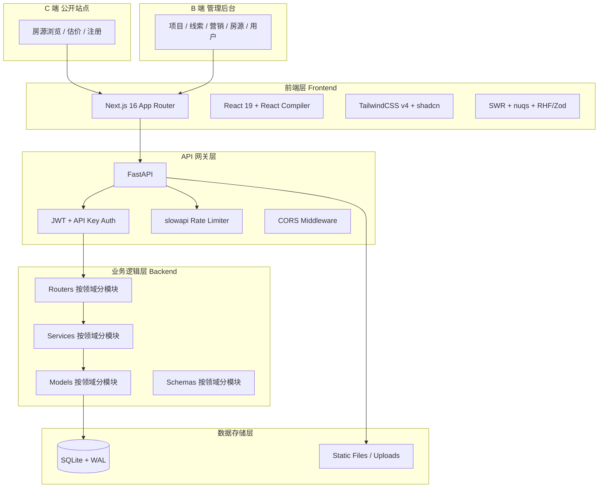
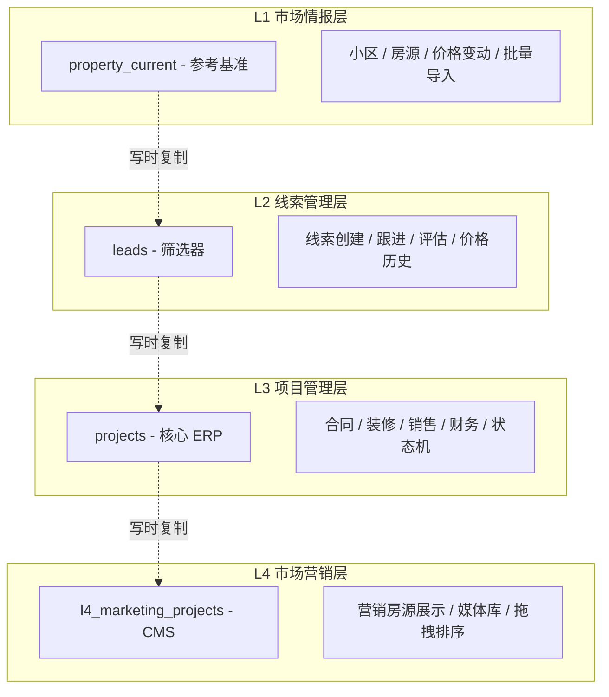
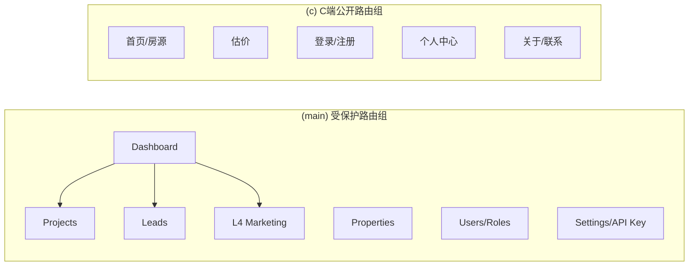
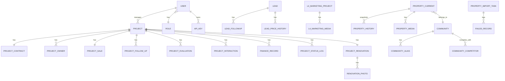
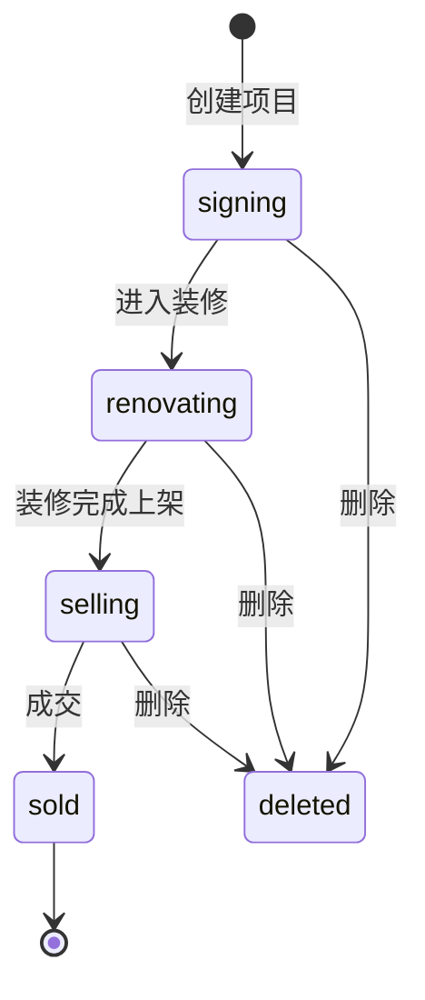
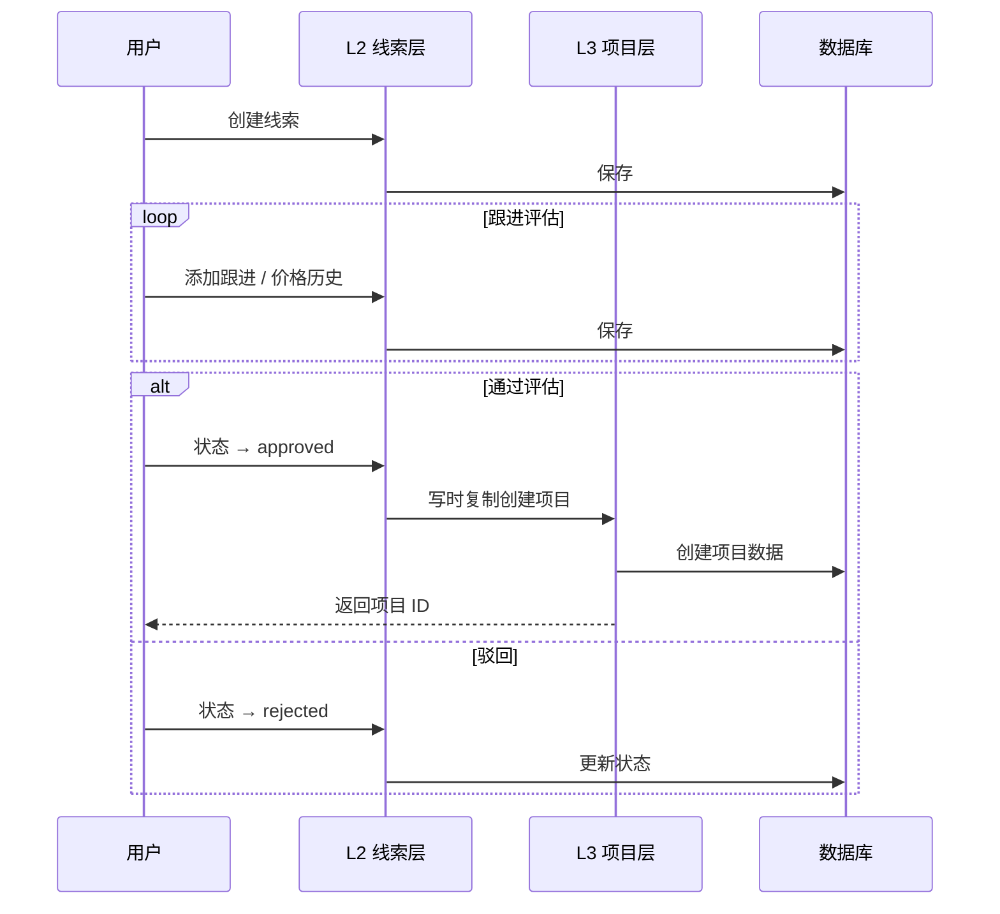
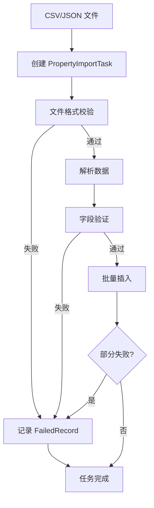
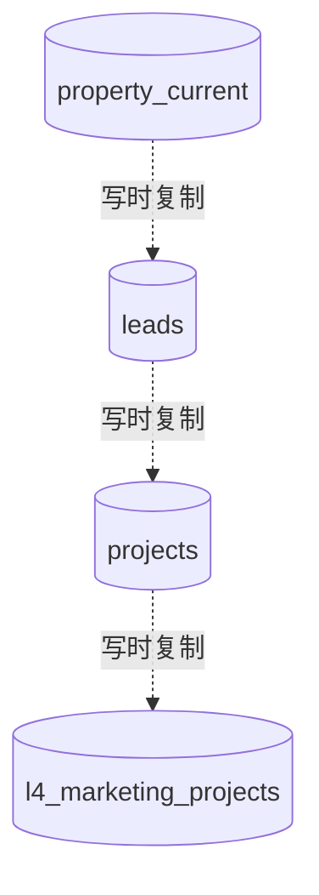

# ProFo 房地产翻新与销售管理系统

<p align="center">
  
  
  
  
  
  
</p>

<p align="center">
  <b>轻量级、本地化、高性能的房产数据中心</b><br/>
  <sub>四层领域架构 · B端ERP + C端营销 · JWT + API Key 双认证</sub>
</p>

---

## 📋 目录

1. [项目概述](#-项目概述)
2. [技术架构](#-技术架构)
3. [环境搭建](#-环境搭建)
4. [开发命令](#-开发命令)
5. [配置说明](#-配置说明)
6. [API 接口](#-api-接口)
7. [数据库设计](#-数据库设计)
8. [核心业务流程](#-核心业务流程)
9. [部署指南](#-部署指南)
10. [开发规范](#-开发规范)
11. [常见问题](#-常见问题)
12. [项目结构](#-项目结构)

---

## 🏠 项目概述

### 项目背景

ProFo 是一个面向房地产翻新与销售业务的全流程管理系统，采用 **四层业务领域架构**，覆盖从市场情报采集到 C 端营销展示的全链路数据管理。系统同时提供 B 端运营后台和 C 端公开站点。

### 核心功能

| 模块 | 功能描述 | 业务层级 |
|------|---------|---------|
| **L1 市场情报层** | 小区信息管理、房源市场数据、价格变动记录、CSV/JSON 批量导入 | 数据基准 |
| **L2 线索管理层** | 卖房估价线索创建、跟进、评估、价格历史 | 漏斗瓶颈 |
| **L3 项目管理层** | 合同管理、装修管控、销售跟进、财务现金流、状态机 | 核心 ERP |
| **L4 营销层** | 营销房源 CMS、照片拖拽排序、媒体库、预览发布 | 门面展示 |
| **市场监控** | 竞品对比、小区雷达、趋势定位、市场情绪、AI 策略 | 决策辅助 |
| **C 端公开站点** | 房源浏览、估价提交、用户注册/登录、个人中心 | 客户触达 |
| **系统管理** | 用户、角色、API Key、文件上传、数据导入任务 | 基础设施 |

### 技术亮点

- 🚀 **Next.js 16 + React 19** — App Router、React Compiler、Server Actions
- ⚡ **FastAPI + SQLAlchemy 2.0** — 异步 Python 后端，分层架构（Router → Service → Model）
- 🎨 **TailwindCSS v4 + Radix UI / shadcn** — 现代化 UI 组件库
- 🔐 **JWT + API Key 双认证** — httpOnly Cookie 存 Token，`X-API-Key` 头用于服务间调用
- 🔒 **Fernet 对称加密** — 身份证 / 手机号 / 微信会话密钥等敏感字段加密存储
- 📊 **四层领域架构** — 清晰的业务边界，层间写时复制（CoW）
- 🖱️ **dnd-kit 拖拽排序** — 营销照片虚拟列表 + 拖拽排序 + 性能监控
- 🛡️ **slowapi 速率限制** — 接口级防滥用
- ⚙️ **统一异常处理** — Service 层 `ServiceException`，全局 handler 统一捕获

---

## 🏗️ 技术架构

### 系统整体架构



### 四层业务领域架构



### 前端架构

#### 技术栈

| 技术 | 版本 | 用途 |
|------|------|------|
| Next.js | 16.1.7 | React 框架，App Router、Server Actions |
| React | 19.2.1 | UI 库，React Compiler 优化 |
| TypeScript | 5.9.3 | 类型安全 |
| TailwindCSS | 4.3 | 原子化 CSS |
| Radix UI / shadcn | 1.4.3 | 无障碍 UI 组件 |
| SWR | 2.4.1 | 服务端状态获取与缓存 |
| nuqs | 2.8.6 | URL 查询参数状态 |
| React Hook Form + Zod | 7.71 / 4.3 | 表单状态与校验 |
| dnd-kit | 6.3 / 10.0 | 拖拽排序 |
| Recharts | 3.7 | 图表可视化 |
| openapi-fetch + openapi-typescript | 0.15 / 7.10 | 类型安全 API 客户端 |
| Vitest + Playwright | 3.2 / 1.59 | 单元测试 + E2E 测试 |

#### 双路由组设计



- **`(main)/layout.tsx`** — 调用 `GET /api/v1/auth/me` 鉴权，未登录跳转 `/login`，标记 `force-dynamic` 以访问 Cookie
- **`(c)/layout.tsx`** — C 端公开站点布局，无需登录

#### 双 API 客户端

| 客户端 | 文件 | 使用场景 | 特性 |
|--------|------|---------|------|
| `fetchClient()` | `lib/api-server.ts` | Server Components / Server Actions | 直接读 Cookie，401 自动刷新 |
| `client` | `lib/api-client.ts` | Client Components | `credentials: "include"`，401 跳 `/login` |

开发环境通过 `next.config.ts` 的 `rewrites` 将 `/api/*` 代理到 `http://127.0.0.1:8000/api/*`，使前后端同域以正常发送 Cookie。

### 后端架构

#### 技术栈

| 技术 | 版本 | 用途 |
|------|------|------|
| FastAPI | ≥ 0.104 | 高性能 Web 框架 |
| SQLAlchemy | ≥ 2.0 | ORM |
| Pydantic | v2 | 数据模型与校验 |
| pydantic-settings | ≥ 2.0 | 环境变量配置 |
| slowapi | ≥ 0.1.9 | 速率限制 |
| python-jose | ≥ 3.3 | JWT |
| passlib + bcrypt | ≥ 1.7 / <4.0 | 密码哈希 |
| cryptography (Fernet) | - | 敏感字段加密 |
| pandas | ≥ 2.1 | 数据处理 |
| alembic | ≥ 1.17 | 数据库迁移（可选） |
| uv | - | 包管理器（替代 pip/venv） |

#### 服务分层（Router → Service → Model）

```
backend/
├── routers/                    # API 路由层（薄，仅参数校验/依赖注入）
│   ├── common/                 # 通用路由（files / push / upload）
│   ├── market/                 # 市场情报（properties / communities）
│   ├── leads/                  # 线索（core / followups / prices）
│   ├── projects/               # 项目（core / renovation / sales / cashflow）
│   ├── marketing/              # 营销（projects / import_）
│   ├── monitor/                # 市场监控
│   ├── public/                 # C 端公开接口（auth / users / projects / leads / communities）
│   └── system/                 # 系统（auth / users / roles）
├── services/                   # 业务逻辑层（按领域模块化）
│   ├── market/                 # 房源查询 / 导入 / 小区合并 / CSV 解析 / 导入任务
│   ├── leads/                  # 线索核心 / 跟进 / 价格（internal/）
│   ├── projects/               # Facade + core / renovation / sales / finance（internal/）
│   ├── marketing/              # 营销项目 / 媒体 / 导入 / 公开
│   ├── monitor/                # 监控服务
│   ├── system/                 # auth / user / role / api_key / error / init / exceptions
│   └── utils/                  # 日期解析等工具
├── models/                     # 数据模型层（按领域模块化）
│   ├── common/                 # Base / BaseModel / 枚举 / encrypted 字段
│   ├── property/               # Community / PropertyCurrent / PropertyHistory / PropertyMedia
│   ├── lead/                   # Lead / LeadFollowUp / LeadPriceHistory
│   ├── project/                # Project 及 8 个子模型（合同/业主/销售/跟进/互动/财务/状态日志/装修）
│   ├── marketing/              # L4MarketingProject / L4MarketingMedia
│   ├── system/                 # FailedRecord / PropertyImportTask
│   └── user/                   # User / Role / ApiKey
├── schemas/                    # Pydantic Schema（按领域分模块）
├── dependencies/               # FastAPI 依赖注入（auth / common / projects）
├── utils/                      # auth / crypto / csv_exporter / file_security / formatters / jwt_validator / param_parser / query_params / security_logger
├── main.py                     # 应用入口
├── db.py                       # SQLAlchemy 引擎 + 会话工厂 + init_db()
├── settings.py                 # Pydantic Settings
├── error_handlers.py           # 全局异常处理器
├── exceptions.py               # 通用异常
└── init_admin.py / init_db.py  # 初始化脚本
```

#### 关键设计模式

- **依赖注入**：`DbSessionDep = Annotated[Session, Depends(get_db)]`，`CurrentUserDep`、`CurrentAdminUserDep`、`CurrentInternalUserDep` 等预定义鉴权依赖
- **服务异常**：Service 层抛出 `ServiceException` / `AuthenticationError` / `ResourceNotFoundError` 等（`services/system/exceptions.py`），由全局 handler 捕获。**禁止在 Service 层抛 `HTTPException`**
- **响应格式**：直接返回 Pydantic 模型；分页用 `PaginatedResponse[T]`；列表查询带过滤+排序
- **逻辑外键**：关联用 `user_id: int` 等软外键，级联由 Service 控制；启动时执行 `PRAGMA foreign_keys=ON`
- **加密字段**：通过 `models/common/encrypted.py` 的 `EncryptedString` 类型自动加密身份证 / 手机号 / 微信会话密钥

#### 统一入口导入

```python
from services import (
    PropertyQueryService, PropertyImporter, CommunityMerger,
    ProjectService, ProjectCoreService, RenovationService, SalesService, FinanceService,
    MarketingProjectService, MarketingImportService,
    AuthService, UserService, RoleService, ApiKeyService,
    MonitorService,
)
# 或按子模块导入
from services.market import PropertyQueryService
from services.projects import ProjectService
```

---

## 🚀 环境搭建

### 开发环境要求

| 环境 | 版本要求 | 说明 |
|------|---------|------|
| Node.js | ≥ 20 | 前端运行环境 |
| pnpm | ≥ 9 | 前端包管理器 |
| Python | ≥ 3.10 | 后端运行环境 |
| uv | 最新 | 后端包管理器（替代 pip/venv） |

### 一键初始化（推荐）

跨平台初始化脚本位于 `deploy/` 目录：

```bash
# macOS / Linux
chmod +x deploy/init.sh
./deploy/init.sh

# Windows (PowerShell / CMD)
deploy\init.bat
```

**脚本执行步骤：**

1. ✅ 检查 Python ≥ 3.10
2. ✅ 安装 / 检查 uv 包管理器
3. ✅ 安装 / 检查 pnpm 包管理器
4. ✅ 创建后端 `backend/.env`（自动生成 JWT 密钥；⚠️ 需手动补充 `ENCRYPTION_KEY` / `WECHAT_APPID` / `WECHAT_SECRET`）
5. ✅ 创建前端 `frontend/.env.local`
6. ✅ `uv sync` 安装后端依赖
7. ✅ `pnpm install` 安装前端依赖
8. ✅ `init_db.py` 创建数据库表
9. ✅ `init_admin.py` 创建角色和管理员

> ⚠️ **重要**：初始化脚本完成后会显示 `admin / admin123` 提示，但**实际管理员密码由 `init_admin.py` 随机生成**并打印在终端（格式 `Temp<12位随机字符>9!`），**仅显示一次**，请立即保存。首次登录强制修改密码（`must_change_password=True`）。

### 手动安装

#### 前端

```bash
cd frontend
pnpm install
cp .env.example .env.local    # 编辑 API 地址
pnpm dev                      # http://localhost:3000
```

#### 后端

```bash
cd backend

# 安装 uv
curl -LsSf https://astral.sh/uv/install.sh | sh        # macOS/Linux
# powershell -c "irm https://astral.sh/uv/install.ps1 | iex"  # Windows

# 创建虚拟环境并安装依赖
uv venv
uv sync

# 配置环境变量（见下节）
cp .env.example .env

# 初始化数据库
uv run python init_db.py

# 创建角色和管理员（首次会打印临时密码）
uv run python init_admin.py

# 启动开发服务器
uv run uvicorn main:app --reload --host 0.0.0.0 --port 8000
# API: http://127.0.0.1:8000
# 文档: http://127.0.0.1:8000/docs
```

---

## 🛠️ 开发命令

### 后端

```bash
cd backend
uv run uvicorn main:app --reload --host 0.0.0.0 --port 8000   # 开发服务器
uv run python init_db.py                                        # 创建所有表
uv run python init_admin.py                                     # 初始化角色和管理员
uv sync                                                         # 安装/同步依赖
uv run pytest                                                   # 运行测试（带覆盖率）
uv run pytest tests/test_foo.py -v                              # 运行单个测试
```

### 前端

```bash
cd frontend
pnpm dev                # 开发服务器（端口 3000）
pnpm build              # 生产构建
pnpm start              # 生产启动
pnpm lint               # ESLint（max-warnings 0）
pnpm test               # Vitest 单元测试
pnpm test:watch         # Vitest watch 模式
pnpm test:coverage      # 覆盖率报告
pnpm gen-api            # 从后端 /openapi.json 重新生成类型（需后端运行）
```

> **接口变更流程**：启动后端 → `curl http://127.0.0.1:8000/openapi.json` 验证 → `pnpm gen-api` → 提交 `src/lib/api-types.d.ts`

---

## ⚙️ 配置说明

### 后端环境变量（`backend/.env`）

| 变量 | 必填 | 默认值 | 说明 |
|------|------|--------|------|
| `JWT_SECRET_KEY` | ✅ | - | JWT 签名密钥，**生产环境务必使用强密钥** |
| `ENCRYPTION_KEY` | ✅ | - | Fernet 对称加密密钥（用于敏感字段），`openssl rand -base64 32` 生成 |
| `WECHAT_APPID` | ✅ | - | 微信 AppID（不使用微信登录也需填占位符） |
| `WECHAT_SECRET` | ✅ | - | 微信 AppSecret |
| `DATABASE_URL` | - | `sqlite:///./data.db` | 数据库连接串 |
| `API_PREFIX` | - | `/api` | API 前缀 |
| `CORS_ORIGINS` | - | `["http://localhost:3000", ...]` | 允许的跨域来源 |
| `FRONTEND_URL` | - | `http://localhost:3000` | 前端 URL（微信回调等） |
| `JWT_ACCESS_TOKEN_EXPIRE_MINUTES` | - | `30` | 访问令牌过期时间 |
| `JWT_REFRESH_TOKEN_EXPIRE_DAYS` | - | `7` | 刷新令牌过期时间 |
| `JWT_KEY_ROTATION_ENABLED` | - | `false` | 是否启用密钥轮换 |
| `JWT_SECRET_KEY_OLD` | - | - | 旧密钥（轮换过渡期） |
| `MAX_UPLOAD_SIZE` | - | `104857600` | 上传大小上限（100 MB） |
| `DEFAULT_PAGE_SIZE` / `MAX_PAGE_SIZE` | - | `50` / `1000` | 分页配置 |
| `DEBUG` | - | `true` | 调试模式 |

### 前端环境变量（`frontend/.env.local`）

| 变量 | 说明 |
|------|------|
| `NEXT_PUBLIC_API_URL` | 浏览器可访问的后端地址（开发环境 `http://127.0.0.1:8000`） |
| `SERVER_API_URL` | 服务端内部直连地址（生产环境绕过 Nginx） |

---

## 🔌 API 接口

所有接口前缀：`/api/v1`，文档地址：`http://127.0.0.1:8000/docs`

### 认证方式

| 方式 | 头部 | 场景 |
|------|------|------|
| JWT | `Authorization: Bearer <token>` 或 httpOnly Cookie | Web 前端用户 |
| API Key | `X-API-Key: <key>` | 服务间调用 / 第三方集成 |

### 主要端点

| 模块 | 路径 | 方法 | 说明 |
|------|------|------|------|
| **认证** | `/auth/login` | POST | 用户登录（返回 access + refresh token） |
| | `/auth/refresh` | POST | 刷新 Token |
| | `/auth/me` | GET | 获取当前用户 |
| | `/auth/logout` | POST | 登出 |
| **项目** | `/projects` | GET/POST | 列表 / 创建 |
| | `/projects/{id}` | GET/PUT/DELETE | 详情 / 更新 / 删除 |
| | `/projects/contract-no/next` | GET | 生成合同编号（格式 `MFB-YYYYMM-XXXX`） |
| | `/projects/{id}/cashflow` | GET/POST | 现金流查询 / 创建 |
| | `/projects/{id}/renovation` | GET/PUT | 装修信息 |
| | `/projects/{id}/sales` | GET/PUT | 销售信息 |
| **线索** | `/leads` | GET/POST | 列表 / 创建 |
| | `/leads/{id}` | GET/PUT/DELETE | 详情 / 更新 / 删除 |
| | `/leads/{id}/follow-ups` | GET/POST | 跟进记录 |
| | `/leads/{id}/prices` | GET/POST | 价格历史 |
| **市场情报** | `/properties` | GET | 房源列表（导出 CSV） |
| | `/communities` | GET/POST | 小区管理 |
| | `/communities/merge` | POST | 小区合并 |
| **营销 L4** | `/admin/l4-marketing/projects` | GET/POST | 营销项目 |
| | `/admin/l4-marketing/projects/{id}` | GET/PUT/DELETE | 营销项目 CRUD |
| | `/admin/l4-marketing/projects/{id}/media` | GET/POST | 媒体管理 |
| | `/admin/l4-marketing/import` | POST | 从 L3 项目导入 |
| **监控** | `/monitor/...` | GET | 竞品 / 雷达 / 趋势 / 情绪 / AI 策略 |
| **C 端公开** | `/public/projects` | GET | 已发布房源列表（无需登录） |
| | `/public/projects/{id}` | GET | 房源详情 |
| | `/public/leads` | POST | 提交估价线索 |
| | `/public/auth/*` | POST | 注册 / 登录 / 微信登录 |
| **系统** | `/users` | GET/POST | 用户管理 |
| | `/roles` | GET/POST | 角色管理 |
| | `/upload` | POST | 文件上传 |
| | `/files` | GET | 文件管理 |
| | `/push` | POST | JSON 数据推送 |

### 速率限制

通过 `slowapi` 实现，默认 200/天、50/小时。关键端点单独配置（如 `@limiter.limit("5/minute")`）。超限返回 `429` + `Retry-After` 头。

### 响应格式

成功响应直接返回 Pydantic 模型；分页响应：

```json
{
  "items": [...],
  "total": 100,
  "page": 1,
  "size": 50
}
```

错误响应（由全局异常 handler 统一封装）：

```json
{
  "code": 404,
  "message": "资源不存在",
  "detail": "Project not found: xxx"
}
```

---

## 🗄️ 数据库设计

### 配置

- **引擎**：SQLite + WAL 模式
- **连接池**：`QueuePool`（`pool_size=10`，`max_overflow=20`，`pool_pre_ping=True`，`pool_recycle=3600`）
- **外键**：通过 `event.listen(engine, "connect", ...)` 在每个连接执行 `PRAGMA foreign_keys=ON`
- **超时**：`timeout=30` 秒
- **编译缓存**：`execution_options={"compiled_cache": {}}`
- **建表**：通过 `Base.metadata.create_all` 自动建表（无 Alembic 迁移目录；如需迁移可自行初始化 Alembic）

### ER 概览



### 核心表

| 表 | 模块 | 说明 |
|----|------|------|
| `users` | user | 用户（含微信字段、加密手机号、`must_change_password` 标记） |
| `roles` | user | 角色（admin / operator / user / customer） |
| `api_keys` | user | API Key（哈希存储，过期时间，最后使用时间） |
| `communities` | property | 小区（含别名、竞品关联） |
| `property_current` | property | 房源当前数据 |
| `property_history` | property | 房源历史快照 |
| `property_media` | property | 房源媒体 |
| `leads` | lead | 线索（含评估价、状态、来源 property_id） |
| `lead_followups` | lead | 线索跟进 |
| `lead_price_history` | lead | 线索价格历史 |
| `projects` | project | 项目主表（status: signing/renovating/selling/sold/deleted） |
| `project_contracts` | project | 合同（合同号唯一，自动生成 `MFB-YYYYMM-XXXX`） |
| `project_owners` | project | 业主（身份证加密） |
| `project_sales` | project | 销售信息 |
| `project_renovations` | project | 装修（含硬装合同 / 软装 / 设计费 / 拆除费等） |
| `renovation_photos` | project | 装修照片（按阶段） |
| `project_follow_ups` | project | 项目跟进 |
| `project_interactions` | project | 带看 / 出价等互动 |
| `project_evaluations` | project | 评估记录 |
| `finance_records` | project | 财务流水（income/expense） |
| `project_status_logs` | project | 状态变更日志 |
| `l4_marketing_projects` | marketing | 营销项目 |
| `l4_marketing_media` | marketing | 营销媒体 |
| `property_import_tasks` | system | 导入任务（CSV/JSON 批量） |
| `failed_records` | system | 导入失败记录 |

### 索引策略

- 高频筛选字段（`status`、`is_deleted`）建索引
- 外键字段建索引（`project_id`、`user_id`、`community_id`）
- 唯一约束建唯一索引（`username`、`phone`、`contract_no`）
- 复合索引优化多条件查询（如 `(project_id, record_date)`）

---

## 🔄 核心业务流程

### 项目生命周期



各阶段在 `project_detail/views/` 下有独立视图：
- `default/` — 基础信息 + 附件 + 交付
- `renovation/` — 装修时间线 + 合同 + 成本汇总 + 阶段照片
- `selling/` — 活动 / 团队 / KPI / 成交对话框
- `sold/` — 财务生命周期 + 视觉旅程 + 总结报告

### 线索转化



### 数据导入流程



### 四层数据流转



---

## 🌐 部署指南

部署相关文件全部位于 [`deploy/`](deploy/) 目录，详细指引见 [deploy/deploy-doc.md](deploy/deploy-doc.md)。

### 部署方案

**本地构建 + 上传服务器**（适用于低配阿里云服务器）：

```bash
cd deploy
./deploy.sh           # macOS/Linux
deploy\deploy.bat     # Windows
```

脚本自动完成：
1. 本地 `pnpm build` 生成 `frontend/.next`
2. 上传 `frontend/.next`、`backend/`、`deploy/` 到服务器 `/root/profo/`
3. 服务器执行 `uv sync`、`pnpm install --prod`
4. PM2 启动 / 重启 `profo-backend` 和 `profo-frontend`

### 首次部署

1. **服务器初始化**：`ssh root@server` → `cd /root/profo/deploy && ./setup-server.sh`
2. **配置生产环境变量**：
   - `cp deploy/.env.backend.production backend/.env` → 修改 `JWT_SECRET_KEY`、`ENCRYPTION_KEY`、`WECHAT_*`
   - 建议把 `DATABASE_URL` 改为独立目录（如 `sqlite:////root/profo-data/data.db`），避免部署覆盖
3. **PM2 启动**：`pm2 start ecosystem.config.js && pm2 save && pm2 startup`
4. **验证**：`curl http://127.0.0.1:8000/health` 应返回 `healthy`

### 生产架构

```
浏览器 → Nginx (443/80) ─┬─→ frontend (3000, PM2)
                         ├─→ backend  (8000, PM2, uv run)
                         └─→ /static/ (静态文件)
```

### PM2 常用命令

```bash
pm2 status                          # 查看状态
pm2 logs profo-backend --lines 50   # 查看后端日志
pm2 restart profo-backend           # 重启后端
pm2 monit                           # 监控面板
```

---

## 📐 开发规范

详见 [AGENTS.md](AGENTS.md)。核心要点：

### 通用

- **不准猜**：需求歧义列出选项再问；困惑立刻停手描述
- **全栈归位**：业务逻辑/持久化 → 后端；交互/计算 → 前端
- **最简代码**：不写非必需功能；单次使用不抽 util/hook
- **精准修改**：只改需求相关，不动相邻代码；清理孤儿 import/变量

### 前端

- 默认 Server Component，仅 `'use client'` 当需浏览器 API / 客户端状态
- shadcn/ui：不修改 `ui/` 源码，样式用 `cn()` 覆盖，逻辑封装到 `custom/`
- 类型：API 消费用 `pnpm gen-api` 生成，禁手写
- 表单 Zod schema 需与后端 Pydantic 语义对齐

### 后端

- 严格分层 Router → Service → Model，Router 禁 SQL 查询
- 关联用逻辑外键，级联由 Service 处理
- Service 层抛 `ServiceException`，**禁止抛 `HTTPException`**
- 所有函数完整类型注解；Pydantic 分 `*Create/*Update/*Response/*Filter`
- 文件 >250 行需注释说明不拆理由

### 提交前

- `pytest` 全绿，`tsc --noEmit` 零错，`pnpm lint` 通过
- 接口变更：启后端 → `pnpm gen-api` → 提交生成的类型
- 账号密码从环境变量读取，**严禁硬编码提交**

### Conventional Commits

```
<type>(<scope>): <subject>

类型: feat | fix | docs | style | refactor | test | chore
```

---

## ❓ 常见问题

### Q1: 后端启动报 `JWT_SECRET_KEY not set` / `ENCRYPTION_KEY not set`

`backend/.env` 缺少必填环境变量。生成密钥：

```bash
openssl rand -hex 32          # JWT_SECRET_KEY
openssl rand -base64 32       # ENCRYPTION_KEY (Fernet)
```

### Q2: 忘记管理员密码

重新运行初始化脚本可重置：

```bash
cd backend
uv run python init_admin.py
```

> ⚠️ 该脚本会检测已有 admin 用户并跳过。如需强制重置，需手动删除 `users` 表中 `username='admin'` 记录后重跑。

### Q3: 前端类型错误 `Property 'xxx' does not exist`

后端接口变更后未同步类型：

```bash
# 1. 启动后端
cd backend && uv run uvicorn main:app --reload

# 2. 重新生成类型
cd frontend && pnpm gen-api
```

### Q4: API 返回 401

检查清单：
1. 请求头包含 `Authorization: Bearer <token>` 或通过 httpOnly Cookie
2. Token 未过期（默认 30 分钟，可用 refresh token 刷新）
3. 用户状态为 `active`
4. 用户具有相应权限（admin / operator / user / customer）

### Q5: SQLite 数据库锁定

连接池已配置 `timeout=30`。若仍出现，检查是否有长事务未提交，或调大 `pool_size`。

### Q6: 文件上传失败

- 大小不超过 100 MB
- 类型在允许列表：`.jpg .jpeg .png .pdf .xlsx .xls .csv .doc .docx .md`
- `static/uploads` 目录有写入权限
- `Content-Type: multipart/form-data`

### Q7: 部署后数据库"丢失"

`deploy.sh` 整目录覆盖会导致 `data.db` 被覆盖。建议把数据库放到代码目录之外：

```env
DATABASE_URL=sqlite:////root/profo-data/data.db
```

### Q8: 生产环境 Nginx 502

```bash
pm2 status                                    # 检查进程是否在线
pm2 logs profo-backend --lines 50             # 查看后端日志
ss -tlnp | grep -E ':(3000|8000)\b'           # 检查端口监听
tail -n 50 /var/log/nginx/profo.error.log     # Nginx 错误日志
```

### Q9: 前端启动报 `Module not found`

```bash
cd frontend
rm -rf node_modules pnpm-lock.yaml .next
pnpm install
```

---

## 📁 项目结构

```
ProFo/
├── README.md                      # 本文件
├── AGENTS.md                      # 编码规范（必读）
├── CLAUDE.md                      # Claude Code 指引
├── DESIGN.md                      # 设计风格参考
│
├── frontend/                      # 前端（Next.js 16）
│   ├── src/
│   │   ├── app/
│   │   │   ├── (main)/            # B 端受保护路由组
│   │   │   │   ├── admin/         # 仪表盘 + 市场数据
│   │   │   │   ├── projects/      # 项目管理（cashflow / monitor / detail views）
│   │   │   │   ├── leads/         # 线索管理（含监控仪表盘）
│   │   │   │   ├── l4-marketing/  # 营销 CMS（照片 DnD + 预览）
│   │   │   │   ├── properties/    # 房源（列表 / 上传 / 治理合并）
│   │   │   │   ├── users/         # 用户 + 角色管理
│   │   │   │   ├── settings/api-key/  # API Key 管理
│   │   │   │   └── layout.tsx     # 鉴权布局
│   │   │   ├── (c)/               # C 端公开路由组
│   │   │   │   ├── projects/      # 房源浏览
│   │   │   │   ├── valuation/     # 估价提交
│   │   │   │   ├── login/ register/ my/ profile/
│   │   │   │   └── about/ contact/
│   │   │   ├── login/             # B 端登录
│   │   │   └── api/auth/refresh/  # Next.js API 路由（Token 刷新）
│   │   ├── components/ui/         # shadcn/ui 组件
│   │   ├── lib/                   # api-server / api-client / api-types / config / formatters / utils
│   │   └── hooks/
│   ├── public/
│   ├── next.config.ts             # React Compiler + rewrites 代理
│   ├── playwright.config.ts       # E2E 测试
│   └── package.json
│
├── backend/                       # 后端（FastAPI）
│   ├── routers/                   # 按领域分模块（见上文）
│   ├── services/                  # 按领域分模块
│   ├── models/                    # 按领域分模块
│   ├── schemas/                   # 按领域分模块
│   ├── dependencies/              # auth / common / projects
│   ├── utils/                     # auth / crypto / csv_exporter / file_security / formatters / jwt_validator / param_parser / query_params / security_logger
│   ├── main.py                    # 应用入口
│   ├── db.py                      # SQLAlchemy 引擎 + 会话
│   ├── settings.py                # Pydantic Settings
│   ├── error_handlers.py          # 全局异常 handler
│   ├── exceptions.py              # 通用异常
│   ├── init_db.py                 # 建表脚本
│   ├── init_admin.py              # 初始化角色和管理员
│   ├── conftest.py                # pytest 配置
│   ├── pyproject.toml             # 依赖与工具配置
│   └── uv.lock
│
├── deploy/                        # 部署相关
│   ├── README.md                  # 部署快速指南
│   ├── deploy-doc.md              # 详细部署文档
│   ├── init.sh / init.bat         # 一键初始化脚本
│   ├── deploy.sh / deploy.bat     # 部署脚本
│   ├── setup-server.sh            # 服务器初始化
│   ├── ecosystem.config.js        # PM2 配置
│   ├── profo-nginx.conf           # Nginx 配置模板
│   ├── .env.backend.production    # 后端生产环境模板
│   └── .env.frontend.production   # 前端生产环境模板
│
├── .github/workflows/lint.yml     # GitHub Actions Lint
└── .gitignore
```

---

## 📚 相关链接

- [FastAPI 官方文档](https://fastapi.tiangolo.com/)
- [Next.js 官方文档](https://nextjs.org/docs)
- [TailwindCSS 官方文档](https://tailwindcss.com/docs)
- [SQLAlchemy 官方文档](https://docs.sqlalchemy.org/)
- [shadcn/ui](https://ui.shadcn.com/)
- [uv 包管理器](https://docs.astral.sh/uv/)

---

<p align="center">
  <b>ProFo — 让房地产翻新与销售管理更简单</b>
</p>
