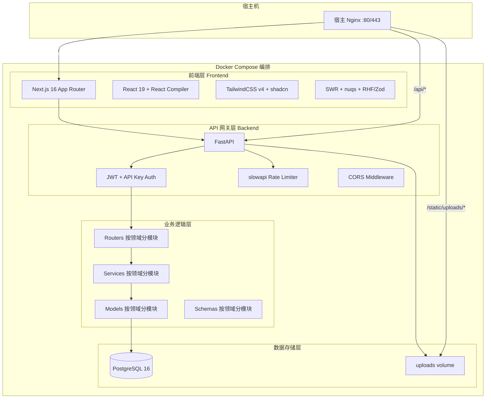
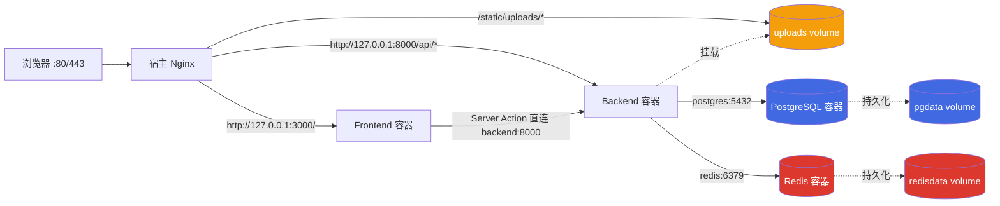
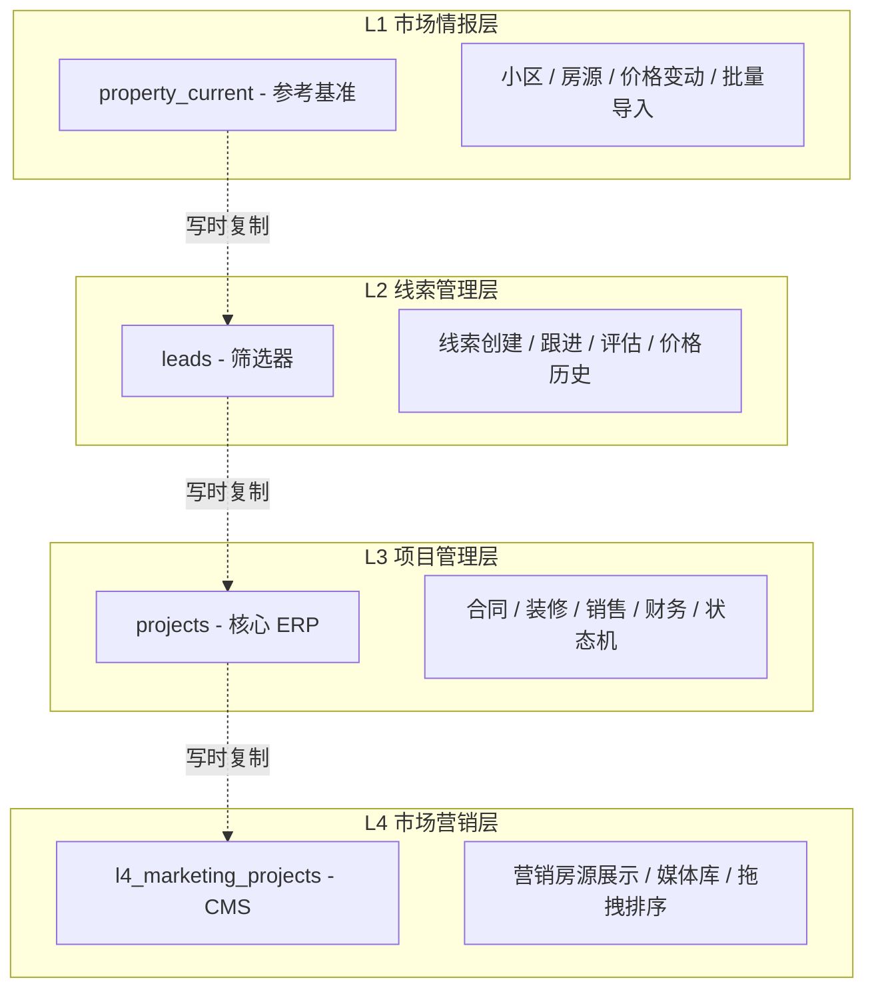
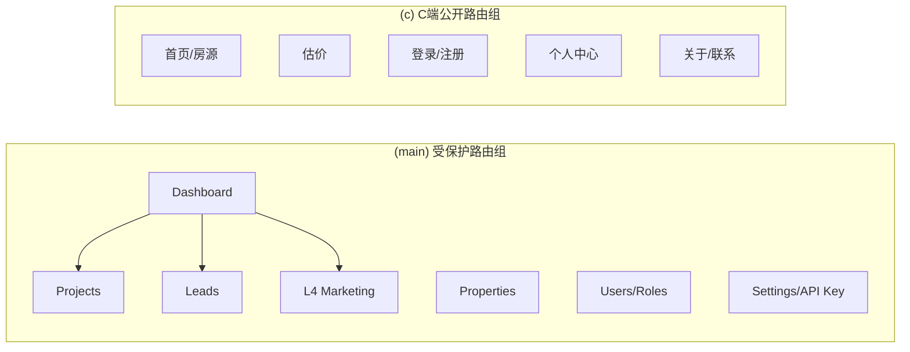
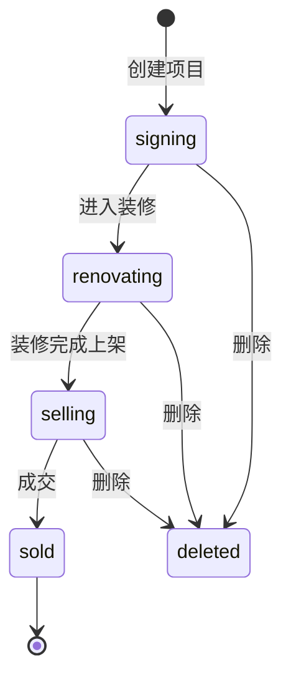
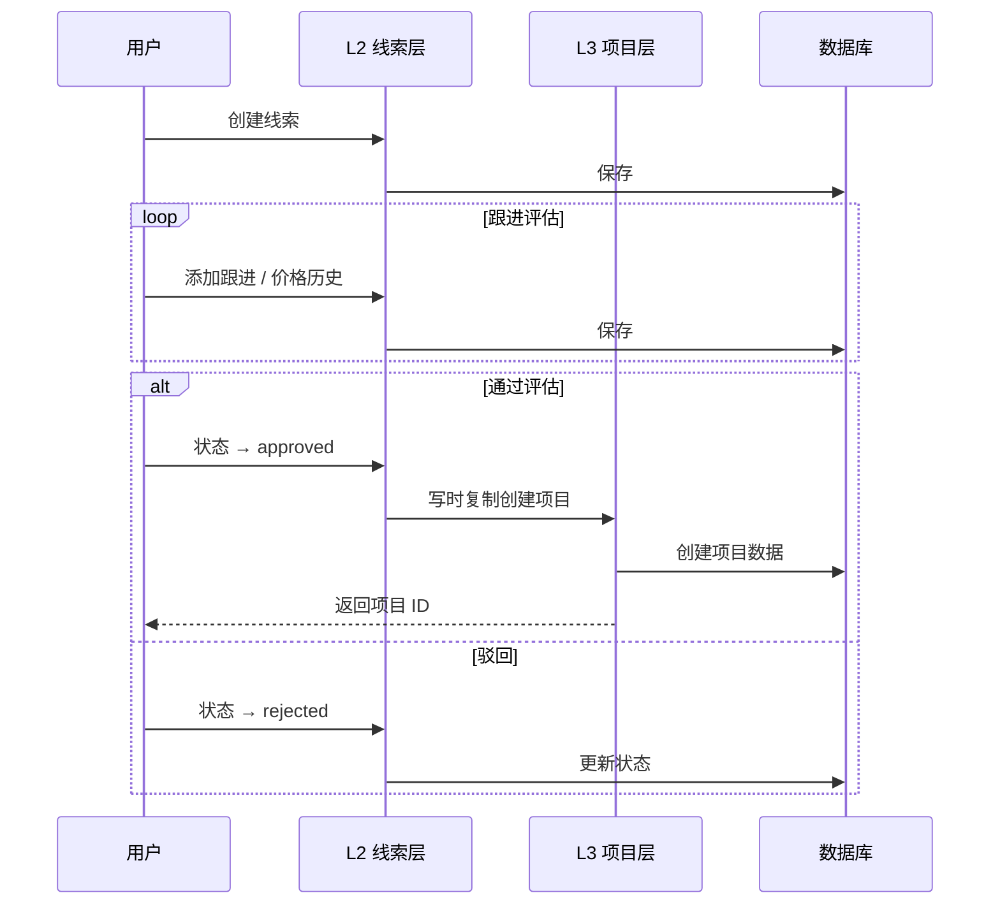
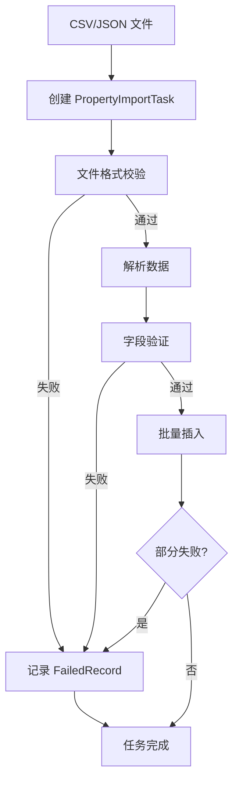
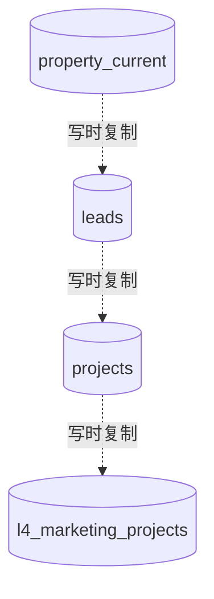

# ProFo 房地产翻新与销售管理系统

<p align="center">
  
  
  
  
  
  
  
  
  
</p>

<p align="center">
  <b>轻量级、本地化、高性能的房产数据中心</b><br/>
  <sub>四层领域架构 · B端ERP + C端营销 · JWT + API Key 双认证 · PostgreSQL + Redis + Docker 一键部署</sub>
</p>

---

## 📋 目录

1. [项目概述](#-项目概述)
2. [技术架构](#-技术架构)
3. [快速开始（Docker）](#-快速开始docker)
4. [本地开发](#-本地开发)
5. [配置说明](#-配置说明)
6. [API 接口](#-api-接口)
7. [数据库设计](#-数据库设计)
8. [核心业务流程](#-核心业务流程)
9. [部署指南](#-部署指南)
10. [数据迁移](#-数据迁移)
11. [开发规范](#-开发规范)
12. [常见问题](#-常见问题)
13. [项目结构](#-项目结构)

---

## 🏠 项目概述

### 项目背景

ProFo 是一个面向房地产翻新与销售业务的全流程管理系统，采用 **四层业务领域架构**，覆盖从市场情报采集到 C 端营销展示的全链路数据管理。系统同时提供 B 端运营后台和 C 端公开站点。

### 核心功能

| 模块 | 功能描述 | 业务层级 |
|------|---------|---------|
| **L1 市场情报层** | 小区信息管理、房源市场数据、价格变动记录、CSV/JSON 批量导入、小区字典 | 数据基准 |
| **L2 线索管理层** | 卖房估价线索创建、跟进、评估、价格历史、线索漏斗统计 | 漏斗瓶颈 |
| **L3 项目管理层** | 合同管理、文书签收、装修管控、销售跟进、状态机 | 核心 ERP |
| **L3 财务账本** | 资金流水账本、收支结算、应收应付、操作日志、Excel 导出 | 核心 ERP |
| **L3 跟投管理** | 跟投记录、投资方管理、分配比例调整、结算流转、操作日志 | 核心 ERP |
| **L4 营销层** | 营销房源 CMS、照片拖拽排序、媒体库（图/视频）、预览发布 | 门面展示 |
| **市场监控** | 竞品对比、小区雷达、趋势定位、市场情绪、AI 策略 | 决策辅助 |
| **数据报表** | 成交趋势、户型/楼层分布、小区对比、市场情绪、涨跌颜色（中国习惯） | 决策辅助 |
| **权限管理** | 角色-权限点关联、操作审计日志、token_version 失效、业务身份双通道校验 | 安全基建 |
| **C 端公开站点** | 房源浏览、估价提交、用户注册/登录、微信 OAuth、个人中心 | 客户触达 |
| **系统管理** | 用户、角色、权限、API Key、刷新令牌、操作审计、文件上传、数据导入任务 | 基础设施 |

### 技术亮点

- 🚀 **Next.js 16 + React 19** — App Router、React Compiler、Server Actions（10mb bodySizeLimit）
- ⚡ **FastAPI + SQLAlchemy 2.0** — 异步 Python 后端，分层架构（Router → Service → Model）
- 🎨 **TailwindCSS v4 + Radix UI / shadcn** — 现代化 UI 组件库
- 🔐 **JWT + API Key 双认证** — httpOnly Cookie 存 Token，`X-API-Key` 头用于服务间调用
- 🔐 **精细化权限系统** — Permission / OperationLog / role_permissions 三表，权限点动态配置，变更触发 `token_version` 递增强制 token 失效；业务身份双通道校验（权限点 + 业务身份标志），Service 层双重防御
- 🛡️ **CSRF 防护中间件** — 纯 Cookie 认证的非安全方法必须携带 `X-Requested-With` 头，Server Action / API Key 不受影响
- 🔒 **Fernet 对称加密** — 身份证 / 手机号 / 微信会话密钥等敏感字段加密存储；`phone_hash` 列承载唯一约束
- 📊 **四层领域架构** — 清晰的业务边界，层间写时复制（CoW）
- 🐘 **PostgreSQL 16** — `TIMESTAMP WITH TIME ZONE` 全量统一（启动迁移自动修复旧列），`psycopg` 高性能驱动
- 🧠 **Redis 7 多 worker 支持** — 限流后端从进程内存升级为 Redis，支持多 worker 部署；密码认证 + maxmemory 24m volatile-lru
- ☁️ **OSS 存储抽象** — `storage_backend=local|oss` 切换，启动迁移自动改写 DB URL 为 OSS URL；本地文件系统与阿里云 OSS 统一接口
- 🐳 **Docker Compose 一键部署** — db / redis / backend / frontend 四服务编排（`linux/amd64` 跨平台构建），由宿主 nginx 反代，开发与生产同构
- 🖱️ **dnd-kit 拖拽排序** — 营销照片虚拟列表 + 拖拽排序 + 性能监控
- 🛡️ **slowapi 速率限制** — 接口级防滥用；可信代理网段（`TRUSTED_PROXIES`）支持 CIDR，防 XFF 伪造
- 📒 **资金账本 / 跟投管理** — 完整的财务流水账本与跟投结算体系，支持多票据、应收应付、分配比例调整、Excel 导出
- 📈 **数据报表模块** — 成交趋势、户型/楼层分布、小区对比、市场情绪，中国习惯涨跌颜色（红涨绿跌）
- ⚙️ **统一异常处理** — Service 层 `ServiceException`，全局 handler 统一捕获；**禁止在 Service 层抛 `HTTPException`**
- 🔁 **Refresh Token 持久化** — `refresh_tokens` 表存储刷新令牌，支持登出吊销
- 📚 **幂等启动迁移** — `migrations/` 目录下 37 个幂等迁移函数，应用启动时自动执行（建表、加列、加密、列类型修复、枚举同步、权限系统初始化、OSS 迁移等）

---

## 🏗️ 技术架构

### 系统整体架构


```mermaid
graph TB
    subgraph "宿主机"
        NX[宿主 Nginx :80/443]
    end
    subgraph "Docker Compose 编排"
        subgraph "前端层 Frontend"
            A[Next.js 16 App Router]
            B[React 19 + React Compiler]
            C[TailwindCSS v4 + shadcn]
            D[SWR + nuqs + RHF/Zod]
        end
        subgraph "API 网关层 Backend"
            F[FastAPI]
            G[JWT + API Key Auth]
            H[slowapi Rate Limiter]
            I[CORS Middleware]
        end
        subgraph "业务逻辑层"
            J[Routers 按领域分模块]
            K[Services 按领域分模块]
            L[Models 按领域分模块]
            M[Schemas 按领域分模块]
        end
        subgraph "数据存储层"
            N[(PostgreSQL 16)]
            O[uploads volume]
        end
    end

    NX -->|/api/*| F
    NX -->|/static/uploads/*| O
    NX -->|/| A
    A --> F
    F --> G
    F --> H
    G --> J
    J --> K
    K --> L
    L --> N
    F --> O
```

### Docker 服务编排


```mermaid
graph LR
    Browser[浏览器 :80/443] --> NX[宿主 Nginx]
    NX -->|http://127.0.0.1:8000/api/*| BE[Backend 容器]
    NX -->|http://127.0.0.1:3000/| FE[Frontend 容器]
    NX -->|/static/uploads/*| UP[(uploads volume)]
    BE -->|postgres:5432| DB[(PostgreSQL 容器)]
    BE -->|redis:6379| Redis[(Redis 容器)]
    BE -.->|挂载| UP
    DB -.->|持久化| PG[(pgdata volume)]
    Redis -.->|持久化| RD[(redisdata volume)]
    FE -->|Server Action 直连 backend:8000| BE

    style DB fill:#4169E1,color:#fff
    style PG fill:#4169E1,color:#fff
    style Redis fill:#DC382D,color:#fff
    style RD fill:#DC382D,color:#fff
    style UP fill:#f59e0b,color:#fff
```

- **db**: `postgres:16-alpine` + `pgdata` 卷持久化
- **redis**: `redis:7-alpine`，密码认证 + `maxmemory 24m volatile-lru` + `redisdata` 卷持久化
- **backend**: FastAPI + uvicorn，挂载 `uploads` 卷，依赖 db + redis healthcheck
- **frontend**: Next.js standalone 模式，Server Action 通过 `http://backend:8000` 直连后端容器
- **nginx**: 反代 + 静态资源缓存，挂载 `uploads` 卷直服上传文件

### 四层业务领域架构


```mermaid
graph TB
    subgraph "L4 市场营销层"
        L4[l4_marketing_projects - CMS]
        L4F[营销房源展示 / 媒体库 / 拖拽排序]
    end
    subgraph "L3 项目管理层"
        L3[projects - 核心 ERP]
        L3F[合同 / 装修 / 销售 / 财务 / 状态机]
    end
    subgraph "L2 线索管理层"
        L2[leads - 筛选器]
        L2F[线索创建 / 跟进 / 评估 / 价格历史]
    end
    subgraph "L1 市场情报层"
        L1[property_current - 参考基准]
        L1F[小区 / 房源 / 价格变动 / 批量导入]
    end

    L1 -.->|写时复制| L2
    L2 -.->|写时复制| L3
    L3 -.->|写时复制| L4
```

### 前端架构

#### 技术栈

| 技术 | 版本 | 用途 |
|------|------|------|
| Next.js | 16.1.7 | React 框架，App Router、Server Actions（standalone 输出） |
| React | 19.2.1 | UI 库，React Compiler 优化 |
| TypeScript | 5.9.3 | 类型安全 |
| TailwindCSS | 4.3 | 原子化 CSS |
| Radix UI / shadcn | 1.4.3 | 无障碍 UI 组件 |
| SWR | 2.4.1 | 服务端状态获取与缓存 |
| nuqs | 2.8.6 | URL 查询参数状态 |
| React Hook Form + Zod | 7.71 / 4.3 | 表单状态与校验 |
| @hookform/resolvers | 5.2 | Zod resolver 桥接 RHF |
| dnd-kit | 6.3 / 10.0 | 拖拽排序 |
| Recharts | 3.7 | 图表可视化 |
| @tanstack/react-table | 8.21 | 表格（跟投/账本详情） |
| framer-motion | 12.38 | 动画库 |
| sonner | 2.0 | Toast 通知 |
| lucide-react | 0.559 | 图标库 |
| react-markdown | 10.1 | Markdown 渲染（AI 策略展示） |
| react-day-picker | 9.13 | 日期选择 |
| date-fns | 4.1 | 日期工具 |
| next-themes | 0.4 | 主题切换 |
| openapi-fetch + openapi-typescript | 0.15 / 7.10 | 类型安全 API 客户端 |
| Vitest + Playwright | 3.2 / 1.59 | 单元测试 + E2E 测试 |

#### 双路由组设计


```mermaid
graph LR
    subgraph "(main) 受保护路由组"
        M1[Dashboard]
        M2[Projects]
        M3[Leads]
        M4[L4 Marketing]
        M5[Properties]
        M6[Users/Roles]
        M7[Settings/API Key]
    end
    subgraph "(c) C端公开路由组"
        C1[首页/房源]
        C2[估价]
        C3[登录/注册]
        C4[个人中心]
        C5[关于/联系]
    end
    M1 --> M2
    M1 --> M3
    M1 --> M4
```

- **`(main)/layout.tsx`** — 调用 `GET /api/v1/auth/me` 鉴权，未登录跳转 `/login`，标记 `force-dynamic` 以访问 Cookie
- **`(c)/layout.tsx`** — C 端公开站点布局，无需登录

#### 双 API 客户端

| 客户端 | 文件 | 使用场景 | 特性 |
|--------|------|---------|------|
| `fetchClient()` | `lib/api-server.ts` | Server Components / Server Actions | 直接读 Cookie，401 自动刷新 |
| `client` | `lib/api-client.ts` | Client Components | `credentials: "include"`，401 跳 `/login` |

> **Docker 部署关键点**：Server Action 在 frontend 容器内运行，`http://127.0.0.1:8000` 会指向容器自身。需通过 `SERVER_API_URL=http://backend:8000` 环境变量让 Server Action 直连 backend 容器（已在 `docker-compose.yml` 中配置）。

开发环境通过 `next.config.ts` 的 `rewrites` 将 `/api/*` 代理到 `http://127.0.0.1:8000/api/*`，使前后端同域以正常发送 Cookie。

### 后端架构

#### 技术栈

| 技术 | 版本 | 用途 |
|------|------|------|
| FastAPI | ≥ 0.104 | 高性能 Web 框架 |
| SQLAlchemy | ≥ 2.0 | ORM（`Mapped[]` + `mapped_column()` 2.0 语法） |
| Pydantic | v2 | 数据模型与校验 |
| pydantic-settings | ≥ 2.0 | 环境变量配置 |
| slowapi | ≥ 0.1.9 | 速率限制 |
| python-jose | ≥ 3.3 | JWT |
| bcrypt | ≥ 4.0 | 密码哈希（直连 bcrypt，不依赖 passlib） |
| pwdlib[argon2,bcrypt] | ≥ 0.2 | 密码哈希库（与 bcrypt 并存） |
| cryptography (Fernet) | - | 敏感字段加密 |
| psycopg[binary] | ≥ 3.1 | PostgreSQL 高性能驱动 |
| redis | ≥ 5.0 | Redis 客户端（多 worker 限流后端） |
| oss2 | ≥ 2.18 | 阿里云 OSS SDK（存储后端抽象） |
| httpx | ≥ 0.25 | HTTP 客户端（微信 OAuth / API 调用） |
| openpyxl | ≥ 3.1 | Excel 导出（账本/跟投/项目） |
| filetype | ≥ 1.2 | 文件类型嗅探（上传安全） |
| Pillow | ≥ 10.0 | 图片处理（缩略图生成） |
| uv | - | 包管理器（替代 pip/venv） |

> 未使用 Alembic：schema 变更通过 `backend/migrations/` 目录下的幂等启动迁移管理（应用启动时 `lifespan` 自动执行）。

#### 服务分层（Router → Service → Model）

```
backend/
├── constants/                  # 业务常量（documents 文书模板等）
├── routers/                    # API 路由层（薄，仅参数校验/依赖注入）
│   ├── common/                 # 通用路由（files / push / upload）
│   ├── market/                 # 市场情报（properties / communities + 字典）
│   ├── leads/                  # 线索（core / leads / followups / prices / evaluations）
│   ├── projects/               # 项目（core / documents / renovation / sales / cashflow）
│   ├── finance/                # 资金账本（ledger，含统计 / 结算 / 日志 / 导出 / 应收应付）
│   ├── investment/             # 跟投管理（列表 / 详情 / 投资方 / 分配比例 / 结算 / 复制）
│   ├── marketing/              # 营销（projects / import_）
│   ├── monitor/                # 市场监控
│   ├── reports/                # 数据报表（communities / market：成交趋势 / 户型楼层分布 / 小区对比）
│   ├── public/                 # C 端公开接口（auth / users / projects / leads / communities / files）
│   └── system/                 # 系统（auth / users / roles / permissions / operation_logs）
├── services/                   # 业务逻辑层（按领域模块化）
│   ├── market/                 # 房源查询 / 导入 / 小区合并 / CSV 解析 / 导入任务 / 失败处理
│   ├── leads/                  # 线索核心 / 跟进 / 价格 / 评估（internal/）
│   ├── projects/               # Facade + core / renovation / sales
│   │   ├── finance/            # 资金账本（base / ledger / records / receivable_payable / settlement / statistics / statistics_builder / summary）
│   │   └── internal/           # builder / contract_number / creator / documents / owners / query / state / updater
│   ├── investment/             # 跟投管理（base / records / investors / settlement / exporter / service）
│   ├── marketing/              # 营销项目 / 媒体 / 导入 / 公开
│   ├── monitor/                # 监控服务 + neighborhood
│   ├── reports/                # 报表聚合（aggregations / bucketing / cache / dictionaries / filter_builder / exceptions）
│   ├── system/                 # auth / user / role / api_key / permission / operation_log / wechat / error / exceptions / init_service
│   └── utils/                  # 日期解析等工具
├── models/                     # 数据模型层（按领域模块化）
│   ├── common/                 # Base / BaseModel / 枚举 / encrypted 字段
│   ├── property/               # Community / CommunityAlias / CommunityCompetitor / PropertyCurrent / PropertyHistory / PropertyMedia
│   ├── lead/                   # Lead / LeadFollowUp / LeadPriceHistory / LeadEvalHistory
│   ├── project/                # Project + 10 个子模型（合同/文书/业主/销售/跟进/互动/财务/财务日志/状态日志/装修/装修照片）
│   ├── investment/             # Investment / Investor / ReturnAdjustment / InvestmentLog
│   ├── marketing/              # L4MarketingProject / L4MarketingMedia
│   ├── system/                 # FailedRecord / PropertyImportTask / WeChatOAuthState / WeChatTempCode / OperationLog
│   └── user/                   # User / Role / ApiKey / RefreshToken / Permission / UserRole
├── schemas/                    # Pydantic Schema（按领域分模块，含 *Create / *Update / *Response / *Filter）
├── dependencies/               # FastAPI 依赖注入（auth / common / projects，含 *PermDep 权限依赖类）
├── utils/                      # auth(password+token) / crypto / csv_exporter / file_security / formatters / jwt_validator / param_parser / query_params / security_logger / mask / error_formatters / image_processing / redis_client / storage / common(limiter + XFF)
├── migrations/                 # 启动时幂等迁移（37 个函数：列变更 / 明文加密 / 列类型修复 / 枚举同步 / 表创建 / 索引重建 / 权限系统初始化 / OSS 迁移）
├── scripts/                    # 一次性脚本（当前为空）
├── main.py                     # 应用入口（含 CSRF 中间件 + 健康检查 + openapi_tags）
├── db.py                       # SQLAlchemy 引擎 + 会话工厂 + init_db()
├── settings.py                 # Pydantic Settings（app v0.9.0）
├── error_handlers.py           # 全局异常处理器
├── init_admin.py               # 初始化角色与管理员脚本（首次部署手动执行）
├── init_db.py                  # 建表脚本
└── conftest.py                 # pytest 配置（PostgreSQL + SAVEPOINT 隔离）
```

#### 关键设计模式

- **依赖注入**：`DbSessionDep = Annotated[Session, Depends(get_db)]`，`CurrentUserDep`、`CurrentAdminUserDep`、`CurrentInternalUserDep` 等预定义鉴权依赖；`PaginationDep`、`ProjectServiceDep` 等领域依赖；权限依赖类命名约定 `[Resource][Action]PermDep`（如 `UserReadPermDep`），匹配权限码 `[resource]:[action]`
- **权限系统**：`PermissionService` + `require_permission` 依赖注入；权限点动态配置（`permissions` 表），角色-权限点关联（`role_permissions` 表），操作审计日志（`operation_logs` 表）；权限变更触发 `token_version` 递增强制 token 失效；业务身份双通道校验（权限点 + 业务身份标志），Service 层双重防御
- **服务异常**：Service 层抛出 `ServiceException` / `AuthenticationError` / `ResourceNotFoundError` / `ValidationError` / `BusinessLogicError` 等（`services/system/exceptions.py`），由全局 handler 捕获。**禁止在 Service 层抛 `HTTPException`**
- **响应格式**：直接返回 Pydantic 模型；分页用 `PaginatedResponse[T]`；列表查询带过滤+排序（`*Filter` Schema + `Depends()`）
- **逻辑外键**：关联用 `user_id: int` 等软外键，级联由 Service 控制
- **加密字段**：通过 `models/common/encrypted.py` 的 `EncryptedString` 类型自动加密身份证 / 手机号 / 微信会话密钥；`phone_hash` 列承载唯一约束（Fernet 随机 IV 导致原列无法唯一）
- **时区处理**：所有 `DateTime` 列使用 `DateTime(timezone=True)`，PostgreSQL 存储 `TIMESTAMP WITH TIME ZONE`；启动迁移自动将旧 `timestamp without time zone` 列迁移为 `timestamptz`
- **CSRF 防护**：`main.py` 内的 `csrf_protect` 中间件——纯 Cookie 认证的非安全方法（POST/PUT/PATCH/DELETE）必须携带 `X-Requested-With` 头；Server Action 与 API Key 请求使用 Authorization / X-API-Key 头认证，不受影响
- **速率限制**：`utils/common.py` 内 `RateLimits` 集中管理所有端点限流值；`_get_client_ip` 通过 `TRUSTED_PROXIES`（支持 CIDR 网段）从右向左跳过可信代理，防 XFF 伪造

#### 统一入口导入

```python
from services import (
    PropertyQueryService, PropertyImporter, CommunityMerger,
    ProjectService, ProjectCoreService, RenovationService, SalesService, FinanceService,
    CashFlowService, ProjectResponseBuilder, ProjectStateManager,
    MarketingProjectService, MarketingImportService, MarketingMediaService,
    AuthService, UserService, RoleService, ApiKeyService,
    MonitorService,
)
# 跟投管理需按子模块导入（未在顶层 __init__ 暴露）
from services.investment import InvestmentService
# 或按子模块导入
from services.market import PropertyQueryService
from services.projects import ProjectService
```

---

## 🚀 快速开始（Docker）

### 前置条件

- 已安装 **Docker Engine** 与 **Docker Compose v2**（`docker --version` 与 `docker compose version` 都能正常输出）
- 不需要本机安装 Node.js / Python / pnpm / uv —— 所有运行时由容器提供

### 一键启动

```bash
# 1. 生成密钥并初始化 .env（自动从 .env.docker.example 创建并填入随机密钥）
./scripts/init-env.sh
#    会自动生成并写入：
#    - POSTGRES_PASSWORD  数据库强密码（24 位字母数字）
#    - JWT_SECRET_KEY     JWT 签名密钥（64 位 hex）
#    - ENCRYPTION_KEY     Fernet 加密密钥
#    - DATABASE_URL       自动同步新密码
# 查看完整密钥: ./scripts/init-env.sh --show
# 强制重新生成所有密钥: ./scripts/init-env.sh --force

# 2. 构建并启动全部服务
docker compose up -d --build
```

启动后访问 `http://localhost/` 即可看到前端页面，API 走 `http://localhost/api/...`。
> 注：当前架构使用宿主 nginx 反代到 `127.0.0.1:8000/3000`，不再在 compose 内启动 nginx 容器。

### 首次部署：初始化数据库与管理员账号

```bash
# 一键初始化：建表 + 创建角色 + 创建管理员（自动生成临时密码）
./scripts/setup.sh --docker
```

`scripts/setup.sh --docker` 会在 backend 容器内执行 `init_db.py` 与 `init_admin.py`，并打印管理员账号与临时密码。首次登录强制修改密码。

> 默认管理员用户名：`admin`，临时密码由脚本随机生成并打印，首次登录强制修改。

### 验证部署

```bash
# 健康检查（应返回 {"status":"healthy","database":"connected"}）
# 注意：compose 不含 nginx 容器，backend 直接暴露在 127.0.0.1:8000
# 如已配置宿主 nginx 反代到 80 端口，也可用 curl http://localhost/health
curl http://127.0.0.1:8000/health

# 查看服务状态
docker compose ps
```

### 启停命令

| 命令 | 作用 |
|------|------|
| `docker compose up -d` | 启动（后台，复用已有镜像） |
| `docker compose stop` | 停止（保留容器与数据卷） |
| `docker compose restart` | 重启 |
| `docker compose logs -f` | 跟踪全部服务日志 |
| `docker compose ps` | 查看服务状态 |
| `docker compose down` | 停止并删除容器（**保留** `pgdata` volume） |
| `docker compose up -d --build` | 重新构建镜像并启动（代码变更后使用） |

### 持久化

- **PostgreSQL 数据**：`pgdata` volume（数据库文件）
- **上传文件**：`./uploads` 目录通过 bind mount 挂载到 backend `/app/static/uploads`

```bash
docker compose down          # 停止服务，保留 volume 数据
docker compose down -v       # 同时删除 volume（谨慎！数据会丢失）
```

### 查看日志

```bash
docker compose logs -f backend    # 后端日志
docker compose logs -f frontend   # 前端日志
docker compose logs -f db         # 数据库日志
# Nginx 日志在宿主机查看（不在 compose 内）：tail -f /var/log/nginx/access.log
```

### 重建单个服务

修改了某个服务的代码后，单独重建并重启：

```bash
docker compose up -d --build backend   # 仅重建后端
docker compose up -d --build frontend  # 仅重建前端
```

---

## 🛠️ 本地开发

如需在容器外进行本地开发（保留热重载与单步调试），仍可使用原始 Node + Python 工具链。

### 开发环境要求

| 环境 | 版本要求 | 说明 |
|------|---------|------|
| Node.js | ≥ 20 | 前端运行环境 |
| pnpm | ≥ 9 | 前端包管理器 |
| Python | ≥ 3.10 | 后端运行环境（与 Docker 镜像及 `pyproject.toml` 一致） |
| uv | 最新 | 后端包管理器（替代 pip/venv） |
| PostgreSQL | ≥ 14 | 本地数据库（或通过 `docker compose up db` 启动单服务） |

### 仅启动数据库容器（推荐）

开发时前端/后端跑在本机，仅用 Docker 提供 PostgreSQL。`docker-compose.dev.yml` 已将 db 端口映射到宿主 5432：

```bash
# 方式一：用 dev-start.sh（推荐，自动处理 .env 变量与软链）
./dev-start.sh db

# 方式二：手动启动
docker compose -f docker-compose.yml -f docker-compose.dev.yml up -d db
# DATABASE_URL 由 dev-start.sh 或 scripts/setup.sh 自动覆盖为 127.0.0.1:5432
```

### 前端依赖安装

```bash
cd frontend
pnpm install
cp .env.example .env.local    # 默认值可直接用（NEXT_PUBLIC_API_URL=http://127.0.0.1:8000）
cd ..                         # 返回项目根目录
```

### 后端依赖安装

```bash
cd backend

# 安装 uv
curl -LsSf https://astral.sh/uv/install.sh | sh        # macOS/Linux
# powershell -c "irm https://astral.sh/uv/install.ps1 | iex"  # Windows

# 创建虚拟环境并安装依赖
uv venv
uv sync
cd ..                         # 返回项目根目录
```

### 一键初始化（推荐）

在项目根目录执行，完成密钥生成、数据库建表、管理员创建：

```bash
# 1. 生成 .env 密钥（首次运行自动从模板创建 .env）
./scripts/init-env.sh

# 2. 初始化数据库 + 管理员（自动启动 PostgreSQL、建表、创建 admin 用户）
./scripts/setup.sh
#    - 首次运行会自动生成管理员临时密码并打印
#    - 支持参数：
#      ./scripts/setup.sh --admin-password 'P@ssw0rd'   # 使用指定密码
#      ./scripts/setup.sh --reset-admin                 # 重置管理员密码
#      ./scripts/setup.sh --sync-db-password            # 认证失败时同步 DB 密码为 .env 值（保留数据）
#      ./scripts/setup.sh --fresh-db                    # 删除数据卷重建（清空数据，彻底全新环境）
#      ./scripts/setup.sh --skip-db                     # 跳过 DB 启动（已在别处启动时使用）
#      ./scripts/setup.sh --help                        # 查看帮助
```

### 启动开发环境

```bash
# 方式一：一键启动（推荐）
# 自动启动 DB + 后端(uvicorn --reload) + 前端(next dev)
./dev-start.sh

# 方式二：手动分别启动（需开两个终端）
cd backend && uv run uvicorn main:app --reload --host 0.0.0.0 --port 8000
cd frontend && pnpm dev
# API:   http://127.0.0.1:8000
# 文档:  http://127.0.0.1:8000/docs
# 前端:  http://localhost:3000
```

> `dev-start.sh` 支持的子命令：`up`（默认，启动全部）、`db`（仅启动数据库）、`stop`（停止 db 容器）、`status`（查看状态）、`logs`（查看 db 日志）、`down`（删除容器，保留数据卷）。

### 开发命令

```bash
# 后端
cd backend
uv run uvicorn main:app --reload --host 0.0.0.0 --port 8000   # 开发服务器
uv run pytest                                                   # 运行测试（带覆盖率）
uv run pytest tests/test_foo.py -v                              # 运行单个测试

# 前端
cd frontend
pnpm dev                # 开发服务器（端口 3000）
pnpm build              # 生产构建
pnpm lint               # ESLint（max-warnings 0）
pnpm test               # Vitest 单元测试
pnpm test:coverage      # Vitest 带覆盖率
pnpm exec playwright test  # Playwright E2E 测试（配置见 playwright.config.ts）
pnpm gen-api            # 从后端 /openapi.json 重新生成类型（需后端运行）
```

> **接口变更流程**：启动后端 → `curl http://127.0.0.1:8000/openapi.json` 验证 → `pnpm gen-api` → 提交 `src/lib/api-types.d.ts`

---

## ⚙️ 配置说明

### Docker 部署环境变量（项目根目录 `.env`）

由 `docker-compose.yml` 通过 `env_file: .env` 注入 backend 容器，模板见 [`.env.docker.example`](.env.docker.example)。

| 变量 | 必填 | 默认值 | 说明 |
|------|------|--------|------|
| `POSTGRES_USER` | ✅ | `profo` | PostgreSQL 用户名 |
| `POSTGRES_PASSWORD` | ✅ | - | PostgreSQL 强密码（**生产环境务必使用强密码**，仅字母数字，避免 `# @ : /` 等 URL 保留字符） |
| `POSTGRES_DB` | ✅ | `profo` | PostgreSQL 数据库名 |
| `DATABASE_URL` | - | 见 `.env.docker.example` | 数据库连接串；compose 会用 `${POSTGRES_*}` 重新拼装覆盖指向 `db:5432`，此处仅占位 |
| `REDIS_PASSWORD` | ✅ | - | Redis 密码（**生产环境务必使用强密码**，仅字母数字；compose 会注入 `redis-server --requirepass` 与 backend `REDIS_URL`） |
| `REDIS_URL` | - | 见 `.env.docker.example` | Redis 连接串；compose 会用 `${REDIS_PASSWORD}` 重新拼装覆盖指向 `redis:6379`，此处仅占位 |
| `STORAGE_BACKEND` | - | `local` | 存储后端：`local`=本地文件系统，`oss`=阿里云 OSS |
| `OSS_ACCESS_KEY_ID` | 条件必填 | - | OSS AccessKey ID（`STORAGE_BACKEND=oss` 时必填，建议使用 RAM 子账号） |
| `OSS_ACCESS_KEY_SECRET` | 条件必填 | - | OSS AccessKey Secret（`STORAGE_BACKEND=oss` 时必填） |
| `OSS_BUCKET_NAME` | 条件必填 | - | OSS Bucket 名称（`STORAGE_BACKEND=oss` 时必填） |
| `OSS_ENDPOINT` | 条件必填 | - | OSS Endpoint（ECS 同地域用内网 endpoint 免流量费，如 `oss-cn-shanghai-internal.aliyuncs.com`） |
| `OSS_PUBLIC_BASE_URL` | 条件必填 | - | OSS 公网/CDN 访问基址（无尾斜杠，如 `https://cdn.example.com`） |
| `JWT_SECRET_KEY` | ✅ | - | JWT 签名密钥，`openssl rand -hex 32` 生成 |
| `ENCRYPTION_KEY` | ✅ | - | Fernet 对称加密密钥，`python -c "from cryptography.fernet import Fernet; print(Fernet.generate_key().decode())"` 生成（**生成后不可更改**，否则已加密数据无法解密） |
| `WECHAT_APPID` | ✅ | - | 微信 AppID（不使用微信登录也需填占位符） |
| `WECHAT_SECRET` | ✅ | - | 微信 AppSecret |
| `WECHAT_REDIRECT_URI` | - | 见 settings.py | 微信回调地址（生产环境改为实际域名） |
| `FRONTEND_URL` | - | `http://localhost:3000` | 前端 URL（用于微信回调重定向等） |
| `JWT_ACCESS_TOKEN_EXPIRE_MINUTES` | - | `30` | 访问令牌过期时间 |
| `JWT_REFRESH_TOKEN_EXPIRE_DAYS` | - | `7` | 刷新令牌过期时间 |
| `JWT_KEY_ROTATION_ENABLED` | - | `false` | 是否启用密钥轮换 |
| `JWT_SECRET_KEY_OLD` | - | - | 旧密钥（轮换过渡期） |
| `CORS_ORIGINS` | - | `[]` | 允许的跨域来源（同域部署留空即可；list 类型用 JSON 数组格式） |
| `TRUSTED_PROXIES` | - | `["127.0.0.1","::1"]` | 可信代理 IP/CIDR 列表（用于 slowapi 读取 X-Forwarded-For，Docker 部署需补 `172.16.0.0/12` 网段；list 类型用 JSON 数组格式） |
| `API_PREFIX` | - | `/api` | API 前缀 |
| `UPLOAD_DIR` | - | `/app/static/uploads` | 上传目录（容器内路径，勿改） |
| `MAX_UPLOAD_SIZE` | - | `524288000` | 上传大小上限（500 MB，支持视频上传） |
| `DEBUG` | - | `false` | 调试模式（生产必须 false；为 false 时 `/docs` `/redoc` `/openapi.json` 不暴露） |
| `PRODUCTION_DOMAIN` | - | - | 生产域名（可选，作为 frontend 构建参数 `--build-arg PRODUCTION_DOMAIN=...` 注入；nginx 正确传递 Host 头时非必需） |

> **Docker 专有环境变量**（仅在 `docker-compose.yml` 中显式设置，不在 `.env` 中）：
> - `frontend.environment.SERVER_API_URL=http://backend:8000` — Server Action / Server Component 在容器内运行时直连 backend 容器
> - `frontend.build.args.SERVER_API_URL` — 构建时注入 `next.config.ts` 的 rewrites，让 SSR 阶段代理直连 backend 容器
> - `frontend.build.args.PRODUCTION_DOMAIN` — 构建时注入生产域名（可选）
> - `db.command` — PostgreSQL 调优（`shared_buffers=128MB`、`work_mem=4MB`、`maintenance_work_mem=64MB`、`max_connections=50`，适配 1.6G 服务器）
> - `redis.command` — Redis 密码认证 + `maxmemory 24m` + `maxmemory-policy volatile-lru`（容器 `mem_limit=32m`，预留 8MB 给进程本身）；空 `REDIS_PASSWORD` 拒绝启动（防静默关闭认证）
> - 各服务均设 `mem_limit`：db 384m / redis 32m / backend 512m / frontend 256m
> - backend / frontend 服务均设 `platform: linux/amd64`（Mac arm64 开发机需构建 amd64 镜像才能在 x86_64 服务器运行）
> - db / redis / backend 均配置 `healthcheck`；backend `depends_on: db + redis: service_healthy`；frontend `depends_on: backend: service_healthy`

### 前端环境变量（`frontend/.env.local`，仅本地开发）

| 变量 | 说明 |
|------|------|
| `NEXT_PUBLIC_API_URL` | 浏览器可访问的后端地址（开发环境 `http://127.0.0.1:8000`） |
| `SERVER_API_URL` | 服务端内部直连地址（生产环境通过 Nginx，无需设置；Docker 部署由 compose 注入） |

---

## 🔌 API 接口

所有接口前缀：`/api/v1`，文档地址：`http://localhost/docs`（Docker 部署）或 `http://127.0.0.1:8000/docs`（本地开发）

### 认证方式

| 方式 | 头部 | 场景 |
|------|------|------|
| JWT | `Authorization: Bearer <token>` 或 httpOnly Cookie | Web 前端用户 |
| API Key | `X-API-Key: <key>` | 服务间调用 / 第三方集成 |

### 主要端点

所有接口前缀 `/api/v1`，文档地址 `http://localhost/docs`（Docker，需 `DEBUG=true`）或 `http://127.0.0.1:8000/docs`（本地开发）。完整端点见运行中的 `/docs`（DEBUG=true 时暴露）或 `frontend/src/lib/api-types.d.ts`。

| 模块 | 路径 | 方法 | 说明 |
|------|------|------|------|
| **认证** | `/auth/token` | POST | OAuth2 password flow（表单登录） |
| | `/auth/login` | POST | JSON 登录（返回 access + refresh token） |
| | `/auth/refresh` | POST | 刷新 Token |
| | `/auth/me` | GET | 获取当前用户 |
| | `/auth/api-key` | POST | 生成 API Key |
| | `/auth/wechat/authorize` | GET | 微信授权跳转 |
| | `/auth/wechat/callback` | GET | 微信授权回调 |
| | `/auth/wechat/login` | POST | 微信登录（code 换 token） |
| | `/auth/exchange-token` | POST | 临时码换 Token（微信场景） |
| **项目** | `/projects` | GET/POST | 列表 / 创建（支持 `ProjectFilter` + 导出 CSV） |
| | `/projects/stats` | GET | 项目统计 |
| | `/projects/export` | GET | 导出 CSV |
| | `/projects/{id}` | GET/PUT/DELETE | 详情 / 更新 / 删除 |
| | `/projects/{id}/status` | PATCH | 状态转换 |
| | `/projects/{id}/complete` | POST | 标记完成 |
| | `/projects/{id}/report` | GET | 项目报告 |
| | `/projects/contract-no/next` | GET | 生成合同编号（`SH{序号}-{SG/DL}`，按 business_form 区分代理/收购） |
| | `/projects/{id}/documents` | GET/POST | 文书签收列表 / 新增 |
| | `/projects/{id}/documents/initialize` | POST | 批量初始化文书模板 |
| | `/projects/{id}/documents/{doc_id}` | PATCH/DELETE | 更新 / 删除文书 |
| | `/projects/{id}/renovation` | GET/PUT | 装修信息 |
| | `/projects/{id}/renovation/photos` | GET/POST | 装修照片（支持 media_type 区分图/视频） |
| | `/projects/{id}/renovation/contract` | GET/PUT | 装修合同 |
| | `/projects/{id}/selling/{roles,viewings,offers,negotiations,records}` | GET/POST | 销售子模块 |
| | `/projects/{id}/cashflow` | GET/POST | 现金流查询 / 创建 |
| **资金账本** | `/admin/ledger` | GET | 资金账本项目列表（含收支/净现金流/ROI 聚合） |
| | `/admin/ledger/stats` | GET | 全局统计 |
| | `/admin/ledger/export` | GET | Excel 导出 |
| | `/admin/ledger/{project_id}` | GET | 项目流水明细 |
| | `/admin/ledger/{project_id}/statistics` | GET | 项目统计（含计算明细 dialog） |
| | `/admin/ledger/{project_id}/receivable-payable` | GET | 应收应付表格（34 项科目元数据，按业务模式过滤） |
| | `/admin/ledger/{project_id}/logs` | GET | 操作日志 |
| | `/admin/ledger/{project_id}/export` | GET | 项目流水 Excel 导出 |
| | `/admin/ledger/{project_id}/settle` | POST | 结算 |
| | `/admin/ledger/{project_id}/unsettle` | POST | 取消结算 |
| | `/admin/ledger/{record_id}` | PATCH/DELETE | 更新 / 删除流水 |
| **跟投管理** | `/admin/investments` | GET/POST | 跟投记录列表 / 创建 |
| | `/admin/investments/stats` | GET | 统计 |
| | `/admin/investments/export` | GET | Excel 导出 |
| | `/admin/investments/{id}` | GET/PUT/DELETE | 详情 / 更新 / 删除 |
| | `/admin/investments/by-project/{project_id}` | GET | 按项目查跟投 |
| | `/admin/investments/{id}/investors` | GET/POST | 投资方列表 / 新增 |
| | `/admin/investments/{id}/investors/{investor_id}` | PUT/DELETE | 更新 / 删除投资方 |
| | `/admin/investments/{id}/distribution-adjustments` | GET/POST | 分配比例调整记录 |
| | `/admin/investments/{id}/settle` | POST | 结算 |
| | `/admin/investments/{id}/unsettle` | POST | 取消结算 |
| | `/admin/investments/{id}/copy` | POST | 复制跟投记录 |
| **线索** | `/leads` | GET/POST | 列表 / 创建 |
| | `/leads/stats` `/leads/stats/funnel` | GET | 统计 / 漏斗 |
| | `/leads/{id}` | GET/PUT/DELETE | 详情 / 更新 / 删除 |
| | `/leads/{id}/follow-ups` | GET/POST | 跟进记录 |
| | `/leads/{id}/prices` | GET/POST | 价格历史 |
| | `/leads/{id}/evaluations` | GET/POST | 评估历史（GET 按 `evaluated_at` 倒序返回；POST 创建评估记录并同步 `Lead.eval_price`，请求体 `eval_price: Decimal(万) gt=0`、`remark ≤500字`） |
| **市场情报** | `/properties` | GET | 房源列表（支持导出 CSV） |
| | `/properties/communities/search` | GET | 小区搜索 |
| | `/admin/communities` | GET/POST | 小区管理 |
| | `/admin/communities/{id}` | GET/PUT/DELETE | 小区 CRUD |
| | `/admin/communities/merge` | POST | 小区合并 |
| | `/admin/dictionaries` | GET | 小区字典 |
| **营销 L4** | `/admin/marketing/projects` | GET/POST | 营销项目 |
| | `/admin/marketing/projects/{id}` | GET/PUT/DELETE | 营销项目 CRUD |
| | `/admin/marketing/projects/{id}/media` | GET/POST | 媒体管理 |
| | `/admin/marketing/projects/{id}/media/sort-order` | PATCH | 媒体排序 |
| | `/admin/marketing/available-projects` | GET | 可导入的 L3 项目 |
| | `/admin/marketing/projects/import-from-l3/{project_id}` | POST | 从 L3 项目导入 |
| **监控** | `/monitor/communities/{id}/{sentiment,trends,radar,competitors,market-stats}` | GET | 监控数据 |
| | `/monitor/communities/{id}/competitors/{competitor_id}` | POST/DELETE | 竞品管理 |
| | `/monitor/ai-strategy` | GET | AI 策略 |
| **数据报表** | `/admin/reports/market/{trend,distribution,comparison,sentiment}` | GET | 成交趋势 / 户型楼层分布 / 小区对比 / 市场情绪 |
| | `/admin/reports/communities/{id}/...` | GET | 单小区报表详情 |
| **C 端公开** | `/public/projects` `/public/projects/sold` | GET | 已发布 / 已售房源列表（无需登录） |
| | `/public/projects/{id}` | GET | 房源详情 |
| | `/public/projects/{id}/consultant` | GET | 顾问信息 |
| | `/public/stats/platform` | GET | 平台统计 |
| | `/public/leads` `/public/leads/mine` | GET/POST | 提交估价线索 / 我的线索 |
| | `/public/auth/{register,token,refresh,me,logout,wechat/*}` | POST/GET | 注册 / 登录 / 微信 OAuth |
| | `/public/users/{profile,phone}` | GET/PATCH | 用户资料 / 修改手机号 |
| | `/public/communities/search` | GET | C 端小区搜索 |
| | `/public/files/upload` | POST | C 端文件上传 |
| **权限管理** | `/admin/permissions` | GET | 权限点列表（按模块分组） |
| | `/admin/roles/{id}/permissions` | GET/PUT | 查看 / 更新角色权限集 |
| **操作审计** | `/admin/operation-logs` | GET | 操作审计日志列表（含用户 / 模块 / 动作 / 时间筛选） |
| **系统** | `/users` `/users/simple` `/users/me` | GET/POST | 用户管理（含简化列表与当前用户） |
| | `/users/{id}/reset-password` `/users/change-password` `/users/init-data` | POST | 密码管理 |
| | `/roles` | GET/POST | 角色管理 |
| | `/upload/csv` `/upload/tasks` `/upload/download/{filename}` | POST/GET | CSV 上传 / 导入任务 / 下载 |
| | `/files/upload` | POST | 通用文件上传 |
| | `/push` | POST | JSON 数据推送 |

### 速率限制

通过 `slowapi` 实现，默认 200/天、50/小时。关键端点单独配置（如 `@limiter.limit("5/minute")`）。超限返回 `429` + `Retry-After` 头。

### 响应格式

成功响应直接返回 Pydantic 模型；分页响应：

```json
{
  "items": [...],
  "total": 100,
  "page": 1,
  "size": 50
}
```

错误响应（由全局异常 handler 统一封装）：

```json
{
  "code": 404,
  "message": "资源不存在",
  "detail": "Project not found: xxx"
}
```

---

## 🗄️ 数据库设计

### 配置

- **引擎**：PostgreSQL 16（Docker 镜像 `postgres:16-alpine`）
- **驱动**：`psycopg[binary]`（SQLAlchemy 方言 `postgresql+psycopg://`）
- **连接池**：`QueuePool`（`pool_size=10`，`max_overflow=20`，`pool_pre_ping=True`，`pool_recycle=3600`）
- **时区**：所有 `DateTime` 列使用 `DateTime(timezone=True)`，PG 存储为 `TIMESTAMP WITH TIME ZONE`
- **编译缓存**：`execution_options={"compiled_cache": {}}`
- **建表**：通过 `Base.metadata.create_all` 自动建表（应用启动时执行 `init_db()`）
- **数据迁移**：`backend/migrations/` 目录下的 37 个幂等启动迁移函数（应用启动时 `lifespan` 自动执行，多 worker 部署通过 PostgreSQL advisory lock 互斥；详见下方「数据迁移」章节）

### ER 概览


```mermaid
erDiagram
    USER ||--o{ PROJECT : "manages"
    USER }|--|| ROLE : "has"
    USER ||--o{ USER_ROLE : "has additional"
    ROLE ||--o{ USER_ROLE : "has additional"
    USER ||--o{ API_KEY : "owns"
    USER ||--o{ REFRESH_TOKEN : "owns"
    USER ||--o{ WECHAT_OAUTH_STATE : "wechat state"
    USER ||--o{ WECHAT_TEMP_CODE : "wechat temp"
    USER ||--o{ OPERATION_LOG : "logs"
    ROLE ||--o{ ROLE_PERMISSION : "has"
    PERMISSION ||--o{ ROLE_PERMISSION : "granted"
    PROJECT ||--|| PROJECT_CONTRACT : "has"
    PROJECT ||--o{ PROJECT_OWNER : "has"
    PROJECT ||--|| PROJECT_SALE : "has"
    PROJECT ||--o{ PROJECT_FOLLOW_UP : "has"
    PROJECT ||--o{ PROJECT_EVALUATION : "has"
    PROJECT ||--o{ PROJECT_INTERACTION : "has"
    PROJECT ||--o{ PROJECT_DOCUMENT : "has"
    PROJECT ||--o{ FINANCE_RECORD : "has"
    FINANCE_RECORD ||--o{ FINANCE_RECORD_LOG : "logs"
    PROJECT ||--o{ PROJECT_STATUS_LOG : "has"
    PROJECT ||--|| PROJECT_RENOVATION : "has"
    PROJECT_RENOVATION ||--o{ RENOVATION_PHOTO : "has"
    PROJECT ||--o| INVESTMENT : "invested by"
    INVESTMENT ||--o{ INVESTOR : "has"
    INVESTMENT ||--o{ RETURN_ADJUSTMENT : "adjusted by"
    INVESTMENT ||--o{ INVESTMENT_LOG : "logged by"
    LEAD ||--o{ LEAD_FOLLOWUP : "has"
    LEAD ||--o{ LEAD_PRICE_HISTORY : "has"
    LEAD ||--o{ LEAD_EVAL_HISTORY : "has"
    L4_MARKETING_PROJECT ||--o{ L4_MARKETING_MEDIA : "has"
    PROPERTY_CURRENT ||--o{ PROPERTY_HISTORY : "snapshots"
    PROPERTY_CURRENT ||--o{ PROPERTY_MEDIA : "has"
    PROPERTY_CURRENT }o--|| COMMUNITY : "belongs_to"
    COMMUNITY ||--o{ COMMUNITY_ALIAS : "has"
    COMMUNITY ||--o{ COMMUNITY_COMPETITOR : "competes_with"
    PROPERTY_IMPORT_TASK ||--o{ FAILED_RECORD : "logs"
```

### 核心表

| 表 | 模块 | 说明 |
|----|------|------|
| `users` | user | 用户（含微信字段、加密手机号、`phone_hash` 唯一索引、`token_version`、`must_change_password` 标记） |
| `roles` | user | 角色（admin / operator / user / customer） |
| `user_roles` | user | 用户附加角色多对多关联（支持 C 端用户同时持有内部角色） |
| `permissions` | user | 权限点（`code`/`name`/`module`/`category`/`sort_order`/`is_system`，按模块分组） |
| `role_permissions` | user | 角色-权限点关联（动态配置角色权限集） |
| `operation_logs` | system | 操作审计日志（用户 / 模块 / 动作 / 目标 ID / 变更前后） |
| `api_keys` | user | API Key（哈希存储，过期时间，最后使用时间） |
| `refresh_tokens` | user | Refresh Token 持久化（支持登出吊销） |
| `wechat_oauth_states` | system | 微信 OAuth state（防 CSRF，TTL 清理） |
| `wechat_temp_codes` | system | 微信临时码（场景码换 Token 中转） |
| `communities` | property | 小区（含别名、竞品关联） |
| `community_aliases` | property | 小区别名 |
| `community_competitors` | property | 小区竞品关联 |
| `property_current` | property | 房源当前数据 |
| `property_history` | property | 房源历史快照 |
| `property_media` | property | 房源媒体（含 `thumbnail_url`） |
| `leads` | lead | 线索（含评估价 `eval_price`、业主心理预期价 `expected_price`、状态、来源 property_id） |
| `lead_followups` | lead | 线索跟进 |
| `lead_price_history` | lead | 线索价格历史 |
| `lead_eval_histories` | lead | 线索评估历史（含 `eval_price` Decimal(15,2)、`remark`、`evaluator_id`、`evaluated_at`；`idx_lead_eval_history_lead` 索引） |
| `projects` | project | 项目主表（status: signing/renovating/selling/sold/deleted；含 `finance_settlement_status`/`finance_settled_date`/`finance_settled_note`/`business_form`/`commission_start_date`/`commission_end_date`） |
| `project_contracts` | project | 合同（合同号部分唯一索引，`WHERE is_deleted=false`，允许软删后复用） |
| `project_owners` | project | 业主（身份证 / 手机号 / 银行卡加密） |
| `project_sales` | project | 销售信息 |
| `project_renovations` | project | 装修（含硬装合同 / 软装 / 设计费 / 拆除费 / 定制柜 / 窗户 / 墙面处理 / 对接负责人） |
| `renovation_photos` | project | 装修照片（按阶段，含 `media_type` 图/视频区分、`thumbnail_url`） |
| `project_follow_ups` | project | 项目跟进 |
| `project_interactions` | project | 带看 / 出价等互动 |
| `project_evaluations` | project | 评估记录 |
| `project_documents` | project | 文书签收（含状态、归档日期、文件 URL） |
| `finance_records` | project | 财务流水（income/expense，含 `counterparty`/`counterparty_type`/`receipt_urls` 多票据 JSON） |
| `finance_record_logs` | project | 财务流水操作日志（settle/unsettle/create/update/delete） |
| `project_status_logs` | project | 状态变更日志 |
| `investments` | investment | 跟投记录（关联项目，含投资总额、收益总额、结算状态） |
| `investors` | investment | 投资方（子投资人，含分配比例） |
| `return_adjustments` | investment | 分配比例调整记录（默认比例 vs 调整后比例） |
| `investment_logs` | investment | 跟投操作日志 |
| `l4_marketing_projects` | marketing | 营销项目（含 `stage_completed_dates` JSON） |
| `l4_marketing_media` | marketing | 营销媒体（图/视频，排序） |
| `property_import_tasks` | system | 导入任务（CSV/JSON 批量） |
| `failed_records` | system | 导入失败记录 |

### 索引策略

- 高频筛选字段（`status`、`is_deleted`）建索引
- 外键字段建索引（`project_id`、`user_id`、`community_id`）
- 唯一约束建唯一索引（`username`、`phone`、`contract_no`）
- 复合索引优化多条件查询（如 `(project_id, record_date)`）

---

## 🔄 核心业务流程

### 项目生命周期


```mermaid
stateDiagram-v2
    [*] --> signing: 创建项目
    signing --> renovating: 进入装修
    renovating --> selling: 装修完成上架
    selling --> sold: 成交
    sold --> [*]
    signing --> deleted: 删除
    renovating --> deleted: 删除
    selling --> deleted: 删除
```

各阶段在前端 `frontend/src/app/(main)/admin/projects/_components/project-detail/views/` 下有独立视图：
- `default/` — 基础信息 + 附件 + 交付 + 文书签收
- `renovation/` — 装修时间线 + 合同 + 成本汇总 + 阶段照片（图/视频）
- `selling/` — 活动 / 团队 / KPI / 成交对话框
- `sold/` — 财务生命周期 + 视觉旅程 + 总结报告

### 线索转化


```mermaid
sequenceDiagram
    participant U as 用户
    participant L2 as L2 线索层
    participant L3 as L3 项目层
    participant DB as 数据库

    U->>L2: 创建线索
    L2->>DB: 保存
    loop 跟进评估
        U->>L2: 添加跟进 / 价格历史
        L2->>DB: 保存
    end
    alt 通过评估
        U->>L2: 状态 → approved
        L2->>L3: 写时复制创建项目
        L3->>DB: 创建项目数据
        L3-->>U: 返回项目 ID
    else 驳回
        U->>L2: 状态 → rejected
        L2->>DB: 更新状态
    end
```

### 数据导入流程


```mermaid
flowchart TD
    A[CSV/JSON 文件] --> B[创建 PropertyImportTask]
    B --> C[文件格式校验]
    C -->|失败| D[记录 FailedRecord]
    C -->|通过| E[解析数据]
    E --> F[字段验证]
    F -->|失败| D
    F -->|通过| G[批量插入]
    G --> H{部分失败?}
    H -->|是| D
    H -->|否| I[任务完成]
    D --> I
```

### 四层数据流转


```mermaid
graph TB
    L1[(property_current)]
    L2[(leads)]
    L3[(projects)]
    L4[(l4_marketing_projects)]

    L1 -.->|写时复制| L2
    L2 -.->|写时复制| L3
    L3 -.->|写时复制| L4
```

---

## 🌐 部署指南

### 部署架构

```
浏览器 → 宿主 Nginx (:80/443) ─┬─→ frontend 容器 (127.0.0.1:3000, Next.js standalone)
                                ├─→ backend 容器 (127.0.0.1:8000, FastAPI + uvicorn)
                                │     └─→ db 容器 (5432, PostgreSQL 16)
                                └─→ uploads volume (/static/uploads/)
```

### 涉及文件

| 文件 | 作用 |
|------|------|
| [`docker-compose.yml`](docker-compose.yml) | 编排 db / backend / frontend 三个服务，backend/frontend 仅暴露到 `127.0.0.1`，由宿主 nginx 反代 |
| [`backend/Dockerfile`](backend/Dockerfile) | 后端多阶段构建：builder（uv sync）→ runner（uvicorn） |
| [`frontend/Dockerfile`](frontend/Dockerfile) | 前端三阶段构建：deps（pnpm install）→ builder（next build standalone）→ runner |
| [`.env.docker.example`](.env.docker.example) | 环境变量模板（由 `scripts/init-env.sh` 自动复制并填充密钥） |
| [`scripts/init-env.sh`](scripts/init-env.sh) | 一键生成 PostgreSQL/JWT/Fernet 密钥并初始化 `.env` |
| [`scripts/setup.sh`](scripts/setup.sh) | 一键初始化数据库表与管理员账号（支持 `--docker` 生产模式） |
| [`deploy-server.sh`](deploy-server.sh) | 服务器端部署脚本：加载镜像、启动 compose、健康检查 |
| [`deploy-local.sh`](deploy-local.sh) | 本地构建并推送镜像到服务器，触发服务器端部署 |

### 快速部署流程

```bash
# 1. 克隆代码
git clone <repo-url> profo && cd profo

# 2. 生成密钥并初始化 .env（自动从模板创建并填入随机密钥）
./scripts/init-env.sh

# 3. 构建并启动
docker compose up -d --build

# 4. 初始化数据库 + 管理员（首次部署）
./scripts/setup.sh --docker
# 会打印临时密码，首次登录强制修改

# 5. 验证
curl http://127.0.0.1:8000/health
# {"status":"healthy","database":"connected"}
```

### 生产环境注意事项

1. **HTTPS**：当前 compose 内不运行 nginx，生产环境需在宿主机器配置 nginx/Caddy/Traefik 等反代，并终止 HTTPS。宿主反代目标为 `127.0.0.1:3000`（前端）与 `127.0.0.1:8000`（后端 API/静态资源）。nginx 关键配置：
   - `proxy_set_header Host $host;`（Server Actions 自动允许同源 Host，`PRODUCTION_DOMAIN` 非必需）
   - `proxy_set_header X-Forwarded-For $proxy_add_x_forwarded_for;`（slowapi 通过 `TRUSTED_PROXIES` 解析真实客户端 IP）
2. **密钥管理**：`.env` 中的 `JWT_SECRET_KEY` / `ENCRYPTION_KEY` / `POSTGRES_PASSWORD` 务必使用强随机值，**严禁提交到 Git**（`.env` 已在 `.gitignore` 中）。`ENCRYPTION_KEY` 一旦生成不可更改，否则已加密的身份证 / 手机号 / 微信会话密钥将无法解密。
3. **`TRUSTED_PROXIES` 配置**：Docker bridge 网络下，容器内 `request.client.host` 看到的是 Docker 网关 IP（如 `172.18.0.1`），不在默认 `127.0.0.1` 中。需补充 `172.16.0.0/12` 网段，否则所有请求共享网关 IP 对应的限流桶，导致全站限流或限流失效。
4. **数据库备份**：定期备份 `pgdata` volume，或使用 `pg_dump`：
   ```bash
   docker compose exec db pg_dump -U $POSTGRES_USER $POSTGRES_DB > backup_$(date +%F).sql
   ```
5. **日志**：`docker compose logs -f` 跟踪日志；如需持久化，建议配置外部日志驱动。
6. **资源限制**：`docker-compose.yml` 已为低配服务器（1.6G）配置 `mem_limit`：db 384m / backend 512m / frontend 256m。如服务器资源充裕可适当上调。
7. **密码安全**：`POSTGRES_PASSWORD` 避免包含 `#`、`@`、`:`、`/` 等 URL 保留字符，防止 `DATABASE_URL` 解析失败。如必须使用，需对密码做 URL 编码。
8. **跨平台构建**：开发机为 Mac arm64 时，必须显式构建 amd64 镜像才能在 x86_64 服务器运行。`docker-compose.yml` 已默认 `platform: linux/amd64`；`deploy-local.sh` 也已处理跨平台构建。

### 升级流程

```bash
# 拉取最新代码
git pull

# 重新构建并启动（保留数据）
docker compose up -d --build

# 如有 schema 变更，应用会通过 migrations/ 自动执行幂等迁移
```

---

## 🔄 数据迁移

### 启动时数据迁移（自动）

`backend/migrations/` 目录下的迁移在应用启动时由 `main.py` 的 `lifespan` 调用 `run_startup_migrations(engine)` 自动执行，**全部幂等设计**，无需手动执行。多 worker 部署（`uvicorn --workers N`）下通过 PostgreSQL session-level advisory lock 串行化，避免并发迁移竞态。当前包含 37 个迁移函数，主要分类如下：

| 类别 | 迁移函数（节选） | 说明 |
|------|------------------|------|
| **加列 / 加索引** | `add_token_version_column`、`add_phone_hash_column`、`add_stage_completed_dates_column`、`add_thumbnail_url_to_photos`、`add_renovation_extra_amount_columns`、`add_contact_person_id_column`、`add_finance_record_counterparty_columns`、`add_finance_record_receipt_urls_column`、`add_project_finance_settlement_columns`、`add_media_type_to_renovation_photos`、`add_counterparty_type_to_finance_records`、`add_lead_eval_history_and_expected_price` | 为既有表添加新列 / 索引（H-XXX 系列） |
| **删列 / 重命名** | `drop_other_decoration_amount_column`、`drop_soft_actual_cost_column`、`rename_return_adjustment_columns` | 移除前端已弃用的字段，或语义重命名（旧数据清空） |
| **加密 / 数据修复** | `encrypt_existing_phones`、`populate_phone_hash`、`run_fix_image_urls` | 将明文手机号加密为 Fernet 密文并回填 `phone_hash`；将绝对图片 URL 转为相对路径 |
| **建表** | `create_investment_tables`、`create_finance_record_logs_table`、`create_wechat_oauth_tables`、`create_user_roles_table` | 幂等创建跟投管理 4 表、资金账本日志表、微信 OAuth 2 表、用户附加角色关联表 |
| **权限系统建表** | `migrate_permission_system`、`migrate_project_business_permission`、`add_permission_foreign_indexes` | 幂等创建权限系统三表（`permissions` / `role_permissions` / `operation_logs`），初始化系统权限点种子数据，为 4 个内置角色分配默认权限集；业务身份权限增强；权限表外键索引优化 |
| **PG enum 同步** | `add_cashflow_category_enum_values`、`add_project_finance_settlement_columns` | 将 Python 枚举新增值同步到 PostgreSQL `enum` 类型（`ALTER TYPE ... ADD VALUE IF NOT EXISTS`） |
| **列类型修复** | `migrate_record_date_to_timestamptz`、`migrate_project_date_columns_to_date`、`migrate_user_datetime_columns_to_timestamptz`、`migrate_encrypted_columns_to_text`、`migrate_all_datetime_columns_to_timestamptz` | 将旧 `timestamp without time zone` 列统一迁移为 `timestamptz`；将 `VARCHAR(10)` 日期列迁移为 `date`；将 `EncryptedString` 列从 `varchar` 迁移为 `text`（Fernet 密文远超声明长度） |
| **URL 列扩容** | `widen_url_columns_to_text` | URL 列从 `VARCHAR(500)` 迁移为 `text`（OSS/CDN URL 含 query string 可能超长，PG 严格强制 VARCHAR 长度会报错） |
| **业务数据迁移** | `migrate_installation_stage_to_delivery` | 将 projects / renovation_photos / l4_marketing_media 中「安装」阶段数据迁移为「交付」（移除安装阶段） |
| **索引重建** | `rebuild_contract_no_index`、`cleanup_reserved_contracts` | 重建 `idx_contract_no` 为部分唯一索引（`WHERE is_deleted=false`），清理已删除项目的合同记录，允许合同号在项目软删除后被复用 |
| **报表索引** | `add_reports_indexes` | 报表模块复合索引优化（成交趋势 / 户型楼层分布 / 小区对比查询加速） |
| **OSS 迁移** | `migrate_uploads_to_oss` | 启动期仅改写 DB URL 为 OSS URL（仅 `storage_backend=oss` 时执行，已是 OSS URL 的记录跳过）；本地文件上传由带外脚本 `python -m migrations.migrate_uploads_to_oss` 执行 |

---

## 📐 开发规范

### 通用

- **不准猜**：需求歧义列出选项再问；困惑立刻停手描述
- **全栈归位**：业务逻辑/持久化 → 后端；交互/计算 → 前端
- **最简代码**：不写非必需功能；单次使用不抽 util/hook
- **精准修改**：只改需求相关，不动相邻代码；清理孤儿 import/变量

### 前端

- 默认 Server Component，仅 `'use client'` 当需浏览器 API / 客户端状态
- shadcn/ui：不修改 `ui/` 源码，样式用 `cn()` 覆盖，逻辑封装到 `custom/`
- 类型：API 消费用 `pnpm gen-api` 生成，禁手写
- 表单 Zod schema 需与后端 Pydantic 语义对齐

### 后端

- 严格分层 Router → Service → Model，Router 禁 SQL 查询
- 关联用逻辑外键，级联由 Service 处理
- Service 层抛 `ServiceException`，**禁止抛 `HTTPException`**
- 所有函数完整类型注解；Pydantic 分 `*Create/*Update/*Response/*Filter`
- 文件 >250 行需注释说明不拆理由
- Schema 变更通过 `migrations/` 目录下幂等启动迁移管理（应用启动时自动执行）

### 提交前

- `pytest` 全绿，`tsc --noEmit` 零错，`pnpm lint` 通过
- 接口变更：启后端 → `pnpm gen-api` → 提交生成的类型
- 账号密码从环境变量读取，**严禁硬编码提交**

### Conventional Commits

```
<type>(<scope>): <subject>

类型: feat | fix | docs | style | refactor | test | chore
```

---

## ❓ 常见问题

### Q1: 后端启动报 `JWT_SECRET_KEY not set` / `ENCRYPTION_KEY not set`

`.env` 缺少必填环境变量。最简单的方式是运行 `./scripts/init-env.sh` 自动生成所有密钥：

```bash
./scripts/init-env.sh        # 生成并写入 POSTGRES_PASSWORD / JWT_SECRET_KEY / ENCRYPTION_KEY
./scripts/init-env.sh --show # 查看完整密钥（默认打码）
```

或手动生成单个密钥：

```bash
openssl rand -hex 32          # JWT_SECRET_KEY
openssl rand -base64 32       # ENCRYPTION_KEY (Fernet)
# 或
python -c "from cryptography.fernet import Fernet; print(Fernet.generate_key().decode())"
```

### Q2: Docker 部署后管理后台登录显示"网络错误，请连接后端服务"

**根因**：frontend 容器内的 Server Action 默认通过 `http://127.0.0.1:8000` 调后端，但容器内该地址指向 frontend 自身。

**修复**：`docker-compose.yml` 的 frontend 服务已配置 `SERVER_API_URL: http://backend:8000`，让 Server Action 直连 backend 容器。如仍报错，检查：

```bash
docker compose exec frontend wget -qO- http://backend:8000/health
# 应返回 {"status":"healthy","database":"connected"}
```

### Q3: 启动报 `POSTGRES_PASSWORD` URL 解析失败

**根因**：`.env` 中 `POSTGRES_PASSWORD` 包含 `#`、`@`、`:`、`/` 等 URL 保留字符，被 `DATABASE_URL` 解析器误判。

**修复**：改用纯字母数字密码，或对密码做 URL 编码（`python -c "import urllib.parse; print(urllib.parse.quote('你的密码'))"`）。

### Q4: 忘记管理员密码

使用 `scripts/setup.sh --reset-admin` 重置（自动生成新临时密码）：

```bash
# Docker 部署环境
./scripts/setup.sh --docker --reset-admin

# 本地开发环境
./scripts/setup.sh --reset-admin
```

或指定新密码：

```bash
./scripts/setup.sh --docker --admin-password 'YourNew!Pass1'
```

> 密码需满足强度策略：≥8 位，含大小写字母、数字、特殊字符。

### Q5: 前端类型错误 `Property 'xxx' does not exist`

后端接口变更后未同步类型：

```bash
# 1. 启动后端
docker compose up -d backend

# 2. 重新生成类型
cd frontend && pnpm gen-api
```

### Q6: API 返回 401

检查清单：
1. 请求头包含 `Authorization: Bearer <token>` 或通过 httpOnly Cookie
2. Token 未过期（默认 30 分钟，可用 refresh token 刷新）
3. 用户状态为 `active`
4. 用户具有相应权限（admin / operator / user / customer）

### Q7: 文件上传失败

- 大小不超过 500 MB（默认 `MAX_UPLOAD_SIZE=524288000`，支持视频上传）
- 类型在允许列表：`.jpg .jpeg .png .webp .pdf .xlsx .xls .csv .doc .docx .md .mp4 .mov .webm`
- `uploads` volume 挂载正常：`docker compose exec backend ls /app/static/uploads`
- `Content-Type: multipart/form-data`
- 若 `STORAGE_BACKEND=oss`，检查 OSS 配置（见 Q11）

### Q8: 前端启动报 `Module not found`

```bash
cd frontend
rm -rf node_modules pnpm-lock.yaml .next
pnpm install
```

### Q9: 如何重置整个环境（清空数据）

```bash
# 方式一（推荐）：scripts/setup.sh 一键完成"删卷 → 重建 → 建表 → 创建管理员"
# 本地开发：
./scripts/setup.sh --fresh-db
# Docker 生产：
./scripts/setup.sh --docker --fresh-db

# 方式二：手动操作
docker compose down              # 停止并删除容器
docker compose down -v           # 同时删除 pgdata / redisdata volume（数据丢失！）
docker compose up -d --build     # 重新启动
./scripts/setup.sh --docker              # 重新初始化数据库 + 管理员
```

### Q10: 后端启动报 `REDIS_URL not set` 或 Redis 连接失败

**根因**：`backend/settings.py` 已将 `redis_url` 设为必填，限流后端从进程内存升级为 Redis（支持多 worker 部署）。`.env` 缺少 `REDIS_URL` / `REDIS_PASSWORD`，或 compose 中 redis 服务未启动。

**修复**：

```bash
# 1. 确认 .env 包含 REDIS_PASSWORD（scripts/init-env.sh 已自动生成）
grep REDIS_PASSWORD .env

# 2. 确认 redis 容器健康
docker compose ps redis
docker compose logs redis

# 3. 容器内验证连通性（带密码）
docker compose exec redis redis-cli -a "$REDIS_PASSWORD" ping
# 应返回 PONG
```

> Docker 部署下 `REDIS_URL` 由 `docker-compose.yml` 自动拼装为 `redis://:${REDIS_PASSWORD}@redis:6379/0`，无需在 `.env` 中手动填写真实值。本地开发需在 `.env` 中设置 `REDIS_URL=redis://localhost:6379/0`（无密码）或对应密码串。

### Q11: 切换到 OSS 存储后图片 / 视频 404

**根因**：`STORAGE_BACKEND=oss` 时，启动迁移仅改写 DB 中已有的相对 URL 为 OSS URL，**不会自动上传本地文件**。本地 `./uploads` 中的历史文件需通过带外脚本上传到 OSS。

**修复**：

```bash
# 1. 校验 .env 中 5 个 OSS_* 配置项均已填写（settings.py model_validator 强制校验）
grep -E '^OSS_|^STORAGE_BACKEND' .env

# 2. 切换前先上传本地文件到 OSS（在 backend 目录执行）
cd backend
uv run python -m migrations.migrate_uploads_to_oss
# 该脚本的 upload_local_files_to_oss 会扫描本地 uploads 目录并上传到 OSS

# 3. 重启 backend 让启动迁移改写 DB URL
docker compose restart backend

# 4. 验证：浏览器访问任一图片 URL，应跳转到 OSS / CDN 域名
```

> 切换回 `local` 时无需特殊操作——DB 中的 OSS URL 仍可被浏览器直接访问，新上传的文件会写入本地 `./uploads`。建议切换方向前先备份数据库。

### Q12: 启动/初始化报 `password authentication failed for user "profo"`

**根因**：PostgreSQL 数据卷（`pgdata`）是用**旧 `.env` 密码**初始化的，与当前 `.env` 的 `POSTGRES_PASSWORD` 不一致。PostgreSQL 只在**数据卷首次创建**时应用 `POSTGRES_PASSWORD`，之后修改 `.env` **不会自动同步**进数据库。

⚠️ **特别注意**：Docker 卷是引擎级全局资源，**不随 git clone / 删除项目目录而重置**。即使全新 clone 代码，只要这台机器上之前运行过本项目（compose 项目名 = 目录名 → 卷名固定为 `<项目名>_pgdata`），就会复用旧卷、遇到旧密码。常见触发场景：机器上已有旧环境 → 重新 clone + `scripts/init-env.sh`（生成了全新的随机密码）→ 新密码 vs 旧卷密码不匹配。

**修复方式**（`scripts/setup.sh` 已内置认证探测，会主动检测该问题）：

```bash
# 方式 A（推荐，保留数据）：同步数据库密码为 .env 中的值
./scripts/setup.sh --sync-db-password
# 本地:   ./scripts/setup.sh --sync-db-password
# Docker: ./scripts/setup.sh --docker --sync-db-password

# 方式 B（清空数据）：删除数据卷重建，得到彻底全新的环境
./scripts/setup.sh --fresh-db
```

> 不带参数运行时，若检测到认证失败，`scripts/setup.sh` 会进入交互模式让你选择 A / B。
>
> **原理说明**：PostgreSQL 容器每次启动都会用 `.env` 中的 `POSTGRES_PASSWORD` 作为环境变量，但该变量只在数据卷首次 `initdb` 时生效；卷内已初始化的集群密码保持不变。因此修改 `POSTGRES_PASSWORD` 后，要么同步执行 `ALTER USER`（方式 A），要么删除数据卷重建（方式 B）。Redis 无此问题（`--requirepass` 是每次启动时经命令行参数注入的，不持久化在卷中）。

### Q13: 全新电脑上首次初始化的正确步骤

```bash
# 1. 克隆代码
git clone <repo-url> profo && cd profo

# 2. 生成密钥并初始化 .env（自动从模板创建并填入随机密钥）
./scripts/init-env.sh

# 3. 本地开发模式（Docker 只跑数据库，前后端本机热重载）：
./scripts/setup.sh               # 建表 + 创建管理员（打印临时密码）
./dev-start.sh           # 启动 db + 后端 + 前端

# 或 Docker 生产模式（全部容器化）：
docker compose up -d --build
./scripts/setup.sh --docker      # 在容器内建表 + 创建管理员
```

> 首次初始化后请立即保存打印的管理员临时密码（首次登录强制修改）。

---

## 📁 项目结构

```
ProFo/
├── README.md                      # 本文件
├── DESIGN.md                      # 设计风格参考（Steep 主题）
│
├── docker-compose.yml             # Docker Compose 编排（db / redis / backend / frontend，含 healthcheck / mem_limit / platform）
├── docker-compose.dev.yml         # 开发环境 override（映射 db 端口到本地）
├── .env.docker.example            # Docker 部署环境变量模板
├── dev-start.sh                   # 本地开发一键启停（db + backend + frontend，子命令 up/db/stop/status/logs/down）
├── dev-start.bat                  # Windows 版本开发启停脚本
├── deploy-local.sh                # 本地构建镜像并推送到服务器（amd64 跨平台构建）
├── deploy-server.sh               # 服务器端加载镜像并启动 compose
│
├── scripts/                       # 低频工具脚本（初始化 / 备份恢复）
│   ├── init-env.sh                # 一键生成密钥并初始化 .env（支持 --show / --force；Windows 版 init-env.bat / init-env.ps1）
│   ├── setup.sh                   # 一键初始化数据库与管理员账号（支持 --docker / --reset-admin / --admin-password / --skip-db；Windows 版 setup.bat / setup.ps1）
│   └── restore-backup.sh          # 将服务器数据库备份导入本地测试环境
│
├── frontend/                      # 前端（Next.js 16，standalone 输出）
│   ├── src/
│   │   ├── app/
│   │   │   ├── (main)/            # B 端受保护路由组（所有 B 端页面嵌套在 admin/ 下）
│   │   │   │   ├── admin/         # 仪表盘 + 市场数据 + 快捷入口
│   │   │   │   │   ├── audit-logs/      # 操作审计日志（按用户 / 模块 / 动作筛选）
│   │   │   │   │   ├── investments/     # 跟投管理（列表 + 详情：投资方 / 分配比例 / 结算 / 复制 / 日志）
│   │   │   │   │   ├── ledger/          # 资金账本（项目列表 + 流水明细 + 统计 + 结算）
│   │   │   │   │   ├── projects/        # 项目管理（[id] 含 cashflow / renovation / selling + monitor / create-project / project-detail）
│   │   │   │   │   ├── leads/           # 线索管理（含监控仪表盘 + 抽屉详情 + 跟进）
│   │   │   │   │   └── marketing/        # 营销 CMS（照片 DnD + 预览 + 编辑）
│   │   │   │   └── layout.tsx     # 鉴权布局
│   │   │   ├── (c)/               # C 端公开路由组
│   │   │   │   ├── projects/      # 房源浏览
│   │   │   │   ├── valuation/     # 估价提交
│   │   │   │   ├── leads/         # 我的线索
│   │   │   │   ├── login/ register/ my/ profile/
│   │   │   │   └── about/ contact/
│   │   │   ├── login/             # B 端登录
│   │   │   └── api/auth/refresh/  # Next.js API 路由（Token 刷新）
│   │   ├── components/ui/         # shadcn/ui 组件
│   │   ├── lib/                   # api-server / api-client / api-c（C端）/ api-types / auth / formatters / utils / swr / logger / chart-colors / status-colors / i18n
│   │   └── hooks/
│   ├── public/
│   ├── next.config.ts             # React Compiler + rewrites 代理 + images.unoptimized + turbopack
│   ├── Dockerfile                 # 多阶段构建（deps → builder → runner）
│   ├── playwright.config.ts       # E2E 测试
│   └── package.json
│
├── backend/                       # 后端（FastAPI）
│   ├── constants/                 # 业务常量（documents 文书模板 / role_codes 角色码）
│   ├── routers/                   # 按领域分模块（common / market / leads / projects / finance / investment / marketing / monitor / reports / public / system）
│   ├── services/                  # 按领域分模块（含 reports / system/permission / system/operation_log / system/wechat）
│   ├── models/                    # 按领域分模块（common / property / lead / project / investment / marketing / system / user）
│   ├── schemas/                   # 按领域分模块（含 reports / permission / operation_log）
│   ├── dependencies/              # auth / common / projects（含 *PermDep 权限依赖类）
│   ├── utils/                     # auth/(password+token 子目录) / crypto / csv_exporter / file_security / formatters / jwt_validator / param_parser / query_params / security_logger / mask / error_formatters / image_processing / redis_client / storage / common(limiter + XFF)
│   ├── migrations/                # 启动时幂等迁移（37 个函数，详见「数据迁移」章节）
│   ├── scripts/                   # 一次性脚本（当前为空）
│   ├── main.py                    # 应用入口（含 CSRF 中间件 + 健康检查 + openapi_tags）
│   ├── db.py                      # SQLAlchemy 引擎 + 会话（PostgreSQL）
│   ├── settings.py                # Pydantic Settings（app v0.9.0，含 Redis / OSS 配置）
│   ├── error_handlers.py          # 全局异常 handler
│   ├── init_db.py                 # 建表脚本
│   ├── init_admin.py              # 初始化角色和管理员
│   ├── conftest.py                # pytest 配置（PostgreSQL + SAVEPOINT 隔离）
│   ├── Dockerfile                 # 多阶段构建（builder → runner）
│   ├── pyproject.toml             # 依赖与工具配置（ruff select=ALL）
│   └── uv.lock
│
├── .github/workflows/lint.yml     # GitHub Actions Lint
└── .gitignore
```

---

## 📚 相关链接

- [FastAPI 官方文档](https://fastapi.tiangolo.com/)
- [Next.js 官方文档](https://nextjs.org/docs)
- [TailwindCSS 官方文档](https://tailwindcss.com/docs)
- [SQLAlchemy 官方文档](https://docs.sqlalchemy.org/)
- [PostgreSQL 官方文档](https://www.postgresql.org/docs/)
- [Docker Compose 官方文档](https://docs.docker.com/compose/)
- [shadcn/ui](https://ui.shadcn.com/)
- [uv 包管理器](https://docs.astral.sh/uv/)

---

<p align="center">
  <b>ProFo — 让房地产翻新与销售管理更简单</b>
</p>
