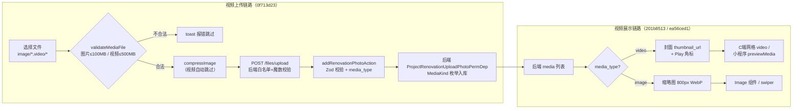

# 代码审查报告：最近 5 次 Commit

- **审查日期**：2026-09-07
- **审查范围**：`b2e90bb3..36c44c7c`（共 5 次提交，20 个文件，+561 / -445 行）
- **审查方式**：静态审查 + 双子代理交叉验证 + 只读工具校验（tsc / ruff / pytest）
- **约束**：仅审查，未修改任何代码

## 一、提交概览

| Commit | 主题 | 变更 |
|---|---|---|
| b2e90bb3 | refactor(lead): 待评估队列返回全量图片列表 | 后端路由/Schema/测试 + 小程序类型 |
| 201b8513 | feat(projects/detail): 营销视频独立展示区块 | 小程序项目详情页 |
| 0f713d23 | feat(admin/renovation): 支持上传展示装修视频 | admin 移动端视图/照片网格/上传 Hook/Server Action |
| ea56ced1 | feat: 改造详情页展示和预览视频媒体 | C端时间线组件 + 小程序详情/装修页 |
| 36c44c7c | refactor(admin): 项目卡片改为跳转详情页 | admin 项目卡片组件重构、删除冗余映射 |

**作者意图**：为装修/营销场景补齐视频媒体能力（上传校验、网格展示、预览播放），并做两处体验/维护性重构（卡片直达详情页、队列返回全量图片供授权页使用）。

## 二、变更流程图

## 三、审查结论（按六个维度）

### 1. 类型/格式 — 通过

- 前后端类型一致：`media_type` 已存在于后端 `RenovationPhotoUpload`（`MediaKind` 枚举，[backend/schemas/project/renovation.py](../backend/schemas/project/renovation.py#L43)）、模型列（[backend/models/project/_project_renovation.py](../backend/models/project/_project_renovation.py)）及启动迁移（`backend/migrations/__init__.py`）；前端生成类型 `api-types.d.ts` 已同步该查询参数，Server Action 的 Zod 枚举 `z.enum(["image","video"])` 与后端语义对齐。
- C端组件手写接口已删除，改为消费生成类型（[RenovationTimeline.tsx](../frontend/src/components/c/project/RenovationTimeline.tsx#L10-L12) 使用 `PublicRenovationStage` / `PublicMediaItem`）。
- 小程序 `miniapp/types/api-types.d.ts` 描述字段同步更新，与后端 Schema 一致。
- 实测：`tsc --noEmit` 零错误；变更后端文件 `ruff check` / `ruff format --check` 全部通过。
- 无 `any` 引入；36c44c7c 删除 `project-card-mapper.ts` 后无孤儿引用（全库检索 `mapProjectResponseToProject` 为 0 命中），无用 import 已清理。

### 2. 依赖安全 — 通过

- 5 次提交均未变更 `package.json` / lockfile，无新增依赖面。
- diff 中无密钥/凭证/token 硬编码（子代理按 password/secret/api_key/PRIVATE KEY 模式全量扫描）。
- 上传文件名经 `sanitize_filename` + `get_safe_file_path` 处理，无路径穿越面。

### 3. 输入与权限 — 通过

- **服务端校验完整**：上传端点 [backend/routers/common/files.py](../backend/routers/common/files.py#L53-L100) 具备扩展名白名单、大小上限（500MB）、`filetype` 魔数嗅探三重校验，不信任前端校验；`media_type` 由后端 `MediaKind` 枚举约束，前端传入非法值会被 Pydantic 拒绝。
- **鉴权齐全**：装修照片上传挂 `ProjectRenovationUploadPhotoPermDep`（[backend/routers/projects/renovation.py](../backend/routers/projects/renovation.py#L76)）；lead 队列接口挂 `CurrentCInternalUserDep` + 限流（[backend/routers/public/leads.py](../backend/routers/public/leads.py#L338-L340)）。
- **Server Action 有 Zod 运行时校验**（[renovation.ts](../frontend/src/app/(main)/admin/projects/actions/renovation.ts#L31-L42)），权限交由后端依赖并已注释说明。
- 敏感信息：提交人手机号继续走 `mask_phone` 脱敏。
- 本批次未触碰 CORS/CSRF 配置，无回归风险。
- 前端两道校验（`handleUpload` 预校验 + `useUpload` 上传前校验）规则一致，无绕过缝隙。

### 4. 数据库与性能 — 通过（2 条低级改进项，见第四节）

- **无 N+1**：两个队列接口的 `lead.creator` 访问由 `selectinload(Lead.creator).joinedload(User.role)` 预加载覆盖（[backend/services/leads/internal/query.py](../backend/services/leads/internal/query.py#L87-L94)），非本次引入且无回归。
- **photo_count 口径一致**：后端统计 renovation 类目全部媒体（含视频），与小程序 `stageMedia.length` 回退口径一致。
- **迁移入库**：`media_type` 列变更走 `backend/migrations/__init__.py` 幂等迁移，符合规范。
- **前端产物**：未新增重型依赖；`compressImage` 对视频直接返回原文件，不产生 Canvas 开销；admin 端视频上传中预览用本地 Blob `<video>`，不请求网络。
- 全量图片返回的载荷影响有界：客户提交端 `MAX_IMAGES=6`（miniapp 提交页），每条最多 6 个 URL 字符串，且经核实**确有消费方**（授权页照片区 + `wx.previewImage` 全量预览，见第六节说明 1）。

### 5. 异常与日志 — 通过

- 后端仅改 2 行返回逻辑 + Schema 描述 + 测试，异常处理链路未触碰；上传端点保留"用户收到通用错误、服务端 `logger.exception` 记录详情"的模式。
- 前端 Server Action 错误统一经 `extractErrorMessage` 兜底并返回 `{"success": false, message}`，`logger.error` 仅记录异常对象，无敏感数据输出。
- 测试同步：`tests/test_lead_pending_assessment.py` 随行为更新，实测 **35 passed**（覆盖率门禁失败仅因单文件运行，非本次问题）。

### 6. 可维护性 — 基本通过（2 条低级改进项，见第四节）

- API 契约一致：`pnpm gen-api` 产物已随提交更新（前端 `api-types.d.ts`、小程序 `api-types.d.ts`）。
- 迁移脚本入库，无 Alembic 漂移。
- 36c44c7c 重构干净：删除抽屉方案后无死代码残留；`<button>` 原生键盘语义取代了手写 `onKeyDown`，可访问性不降级；`ProjectDetailSheet` 仍被项目详情页正常引用，未变孤儿组件。
- 不足：媒体校验逻辑双处复制（问题 3），`docs` 中历史文档含"前 3 张"描述属 Done 归档，无需同步。

## 四、问题清单（经双验证员交叉确认）

| 编号 | 严重级别 | 问题 | 建议 | 位置 |
|---|---|---|---|---|
| 1 | 低 | `useRenovationUpload` 同时传入 `maxSize`/`allowedTypes`/`validateFile`，但 `use-upload.ts` 中自定义校验与内置校验互斥，前两项为永不生效的死配置；若未来移除 `validateFile`，内置校验将以 500MB 统一上限放过 100–500MB 的图片 | 删除这两个冗余选项（或加注释说明仅 `validateFile` 生效）；marketing 的 `use-image-upload.ts` 存在相同死配置，可一并处理 | [use-renovation-upload.ts#L58-L60](../frontend/src/app/(main)/admin/projects/_components/project-detail/views/renovation/components/use-renovation-upload.ts#L58-L60)、[use-upload.ts#L87-L99](../frontend/src/components/common/upload/use-upload.ts#L87-L99) |
| 2 | 低 | C端 `RenovationTimeline` 展开阶段的网格循环内为每个视频直接渲染 `<video preload="metadata">`，多阶段多视频展开时并发发起十余个元数据请求并创建多个解码器；admin 端同场景采用"缩略图 + Play 角标 + 点击后 Dialog 内才渲染 video"的更优方案 | 网格瓦片改为封面图 + 角标占位，点击后再挂载 `<video>`；顺带补齐 `videoUrl` 的 `isValidUrl` 检查（与图片分支一致） | [RenovationTimeline.tsx#L193-L203](../frontend/src/components/c/project/RenovationTimeline.tsx#L193-L203) |
| 3 | 低 | 媒体校验三段逻辑（`ALLOWED_MEDIA_TYPES` 拼接、按类型分档大小校验、`inferIsVideo`）在装修与营销两个上传 Hook 中逐字重复约 20 行，属复制粘贴漂移（问题 1 的死配置即为漂移证据） | 已达两处复用阈值，可提取 `lib/media-validation.ts` 共享；若暂不提取，至少保证两处同步修改 | [use-renovation-upload.ts#L17-L37](../frontend/src/app/(main)/admin/projects/_components/project-detail/views/renovation/components/use-renovation-upload.ts#L17-L37) 与 [use-image-upload.ts#L23-L43](../frontend/src/app/(main)/admin/marketing/_components/photo-manager/use-image-upload.ts#L23-L43) |

> 均为低级问题，无阻塞项；三项可合并为一次小的后续重构。

## 五、验证记录

| 检查项 | 命令 | 结果 |
|---|---|---|
| 前端类型 | `npx tsc --noEmit`（frontend） | 零错误 |
| 后端风格 | `ruff check` / `ruff format --check`（3 个变更文件） | 全部通过 |
| 后端测试 | `.venv/bin/pytest tests/test_lead_pending_assessment.py -q` | 35 passed |
| 密钥扫描 | diff 全量关键词扫描 | 无泄漏 |
| 孤儿引用 | `mapProjectResponseToProject` 全库检索 | 0 命中 |

## 六、确认无误的设计取舍（记录备查）

1. **队列返回全量图片**（b2e90bb3）：初判疑似列表载荷冗余，经核实为有意设计——小程序评估工作台队列项通过 EventChannel 直传授权页作详情数据源，授权页照片区依赖全量 `images` 做 `wx.previewImage`（[authorize/index.ts#L349、L388](../miniapp/pages/valuation/authorize/index.ts#L349)），"已处理"段同样被消费；且 `PublicLeadCreate.images` 限 6 张，载荷增量有界。维持现状即可。
2. **视频无缩略图**：后端上传端点仅对图片生成缩略图，视频 `thumbnail_url` 为空。前端各端（admin 网格、C端时间线、小程序两页）均已实现 Play 图标/黑色占位兜底，并在注释中说明禁止用 `<Image>` 加载原视频、禁止对视频 URL 拼图片处理参数，处理一致且正确。
3. **小程序 `wx.previewMedia` 替换自建轮播弹层**：删除约 80 行手写 swiper 弹层改用原生组件，属合理简化。

## 七、审查方法说明

候选问题经两名独立验证代理并行复核（读取实际代码、核对消费方与执行路径），采用共识计分：2/2 确认纳入问题清单，1/2 确认降级为观察项。本报告问题 1–3 均为 2/2 高置信；"全量图片返回"初判项被 1/2 证伪为有意设计后移入第六节。
